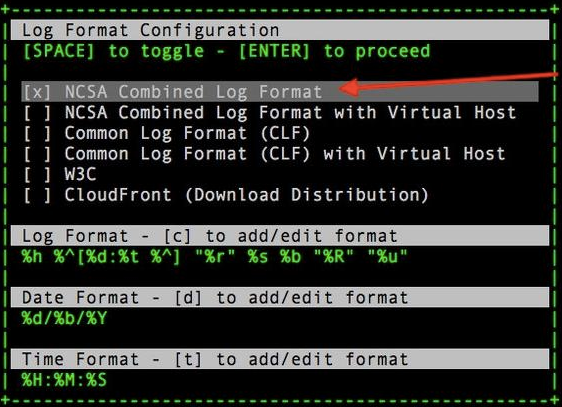
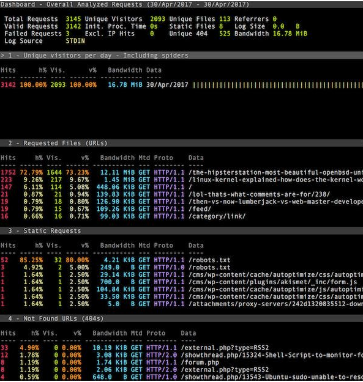

应用-可视化实时Web日志分析工具

GoAccess是一个实时的Apache / Nginx / Lighttpd
Web日志分析器和交互式查看器，可在终端中运行，能为系统管理员提供快速且有价值的
HTTP 统计，并以在线可视化服务器的方式呈现。

GoAccess功能特征

GoAccess解析指定的Web日志文件并将数据输出到X终端。功能包括：

完全实时，所有面板和指标定时在终端输出上每200
ms更新一次，在HTML输出上每秒更新一次。

跟踪应用程序响应时间，如果您想跟踪减慢网站速度的网页，会非常有用。

支持几乎所有Web日志格式， GoAccess允许任何自定义日志格式字符串。

支持增量日志处理，GoAccess能够通过磁盘上的B +
Tree数据库逐步处理日志，保持数据持久性。

可定制配色方案，Tailor GoAccess以适合您自己的色彩品味/方案。

支持大型数据集，GoAccess 为大型数据集提供磁盘B
+树存储，无法将所有内容都安装在内存中。

Docker支持，能够从上游构建GoAccess的Docker镜像。

GoAccess被设计成一个基于终端的快速日志分析器。实时快速分析和查看Web服务器统计信息，无需使用你的浏览器。虽然终端输出是默认输出，但它能够生成完整的，自包含的实时HTML
报告，以及JSON和 CSV报告。

官网传送门：https://goaccess.io/

在Linux上使用Nginx安装GoAccess

首先打开EPEL repo并输入以下yum命令：

yum install epel-release

yum install goaccess

使用源代码方法安装GoAccess

\$ cd /tmp

\$ wget http://tar.goaccess.io/goaccess-1.2.tar.gz

\$ tar -zxvf goaccess-1.2.tar.gz

\$ cd goaccess-1.2/

\$ ./configure --enable-utf8 --enable-geoip=legacy && make

\$ sudo make install

GoAccess常用语法

goaccess -f /path/to/nginx/access.log

goaccess -f /path/to/apache/access.log

goaccess -f /path/to/lighttpd/access.log

goaccess -f /path/to/lighttpd/access.log /path/to/lighttpd/access.log.1

zcat /path/to/nginx/access.log.\*.gz \| goaccess access.log -

goaccess [options] /path/to/lighttpd/access.log

GoAccess实践

如何通过实时报告在屏幕上看到输出？

goaccess -f /var/log/nginx/access.log

置日志文件的日志格式

在屏幕上查看交互式报告，报告如下：

如何生成HTML报告？

语法为：

goaccess -f /var/log/nginx/access.log --log-format=COMBINED -o
www.lovelinux.com.log.html
