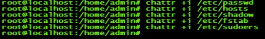

应用-文件权限加固

Linux
系统中常常会因为设置了不正确的文件或目录权限导致出现系统安全问题。因此在日常的系统维护中，应该能做到及时发现不正确的文件权限设置并能及时修正，防患于未然，这里介绍几种用安全加固的方法：

1. 查找系统中任何用户都拥有写入权限的文件或者目录，并保存在文件中用于检查。

find / - type f -perm -2 -o -perm -20 \> wmodfiles.txt

find / - type d -perm -2 -o -perm -20 \> wmoddir.txt

2. 查找系统中没有属主的文件

find / -nouser -o -nogroup \> orphan.txt

这种无属主的文件对于系统的安全也能造成一定的威胁，有时候也会成为入侵者的工具，建议发现之后，要么修改其属主信息，要么删除，以免后患。

3. 查找系统中设置了 S 位的程序

find / -type f -perm -4000 -o -perm -2000 \> smod.txt

含有 S 位权限的程序对系统的威胁很大，可以把某些没必要使用 S
位权限的应用程序去掉，以防用户权限的滥用。

4.利用 chatter 命令来锁定系统的重要文件。

指令使用格式：

chatter [-RV] [-v version] [mode] files…

主要参数说明：

\-R：递归的修改一个目录下的所有文件以及相应的子目录。

\-V：显示修改内容，并在屏幕上打印输出。

Mode：部分是用来设置或修改文件属性的，一般常用的参数是:

\+：在原属性上追加属性。

\-：在原属性上移除属性。

a:
在设定该参数后只能向文件中添加数据而不能删除文件，常用于服务器的系统日志安全（只有root用户才能设定该属性）。

i：在设定该参数后该文件不能被写入数据或者被修改，删除，重命名，设定连接等。

在基本了解该命令的用法后，可以对系统中的常见文件设定安全属性了，

另外，用户也可以对常见目录，例如/bin、/boot、/lib等目录加上 i
属性，对系统常用的日志文件例如 /var/log/messages 和 /var/log/wtmp 也可以加上 a
属性。

虽然通过对重要文件进行加锁的方式能让服务器的安全性提高，但是在运维管理上也会出现一些不方便，例如修改密码时因为
/etc/shadow 文件有 i 属性，会导致密码修改失败。同时对日志文件加入 a
属性，可能会使得日志轮换功能 logrotate
的失败。另外，在软件的安装和升级时可能需要去掉有关目录和文件的 i 属性和 a 属性。

所以，建议用户使用 chattr
命令锁定系统文件时，必须要结合服务器的应用环境来决定是否应用 a 属性和 i 属性。
