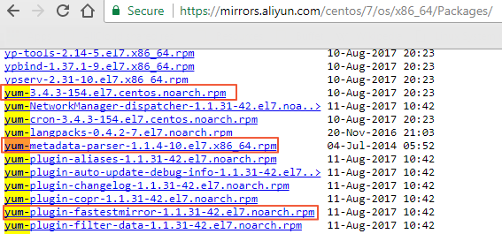

故障-YUM 的常用方法和常见问题处理

YUM 常用命令

YUM 常用命令 描述与示例

yum --help YUM 帮助命令，您可以运行该命令查看详细的 YUM 使用方法。

yum install -y 待安装软件名 安装指定名称的软件。

yum remove -y 待卸载软件名 卸载指定名称的软件。

yum search 待安装软件

搜索指定名称软件的可用安装包。

示例：安装常用的 rz sz 软件，通过 yum install rz 或 yum install rzsz
等都无法找到，通过 yum searh rz 即可找到，可以看到 rz sz 软件属于 lrzsz
这个包。之后再通过 yum install lrzsz 安装。

yum whatprovides

查找指定软件版本中提供 SO 动态库文件的安装包。

在 Linux 实例中安装应用时，有时会因为缺少对应的 SO
动态库文件而报错，比如出现如下报错内容：error while loading shared libraries:
XXXX.so.XXX: cannot open shared object file: No such file or directory。

示例：

运行 yum whatprovides libstdc++.so.6查找指定软件版本提供 SO 动态库文件的安装包。

根据查找内容运行 yum install -y XXXX。

yum clean

清除 YUM 的缓存信息。示例：

yum clean packages：清除缓存中的 RPM 包文件。

yum clean headers：清除缓存中的 RPM 包头文件。

yum clean all：清除缓存中的 RPM 包和头文件（相当于同时执行上述两条命令）。

如何保存 YUM 安装软件时下载的 RPM 包

默认情况下，Linux 实例通过 YUM 安装软件后，会删除 RPM 包。您可以通过修改 YUM
的配置文件保留相应的 RPM 依赖包，以防不时之需。默认的缓存路径是
/var/cache/yum，会根据系统版本和 YUM
源的不同分别保存，您也可以根据实际需要自行修改。此处以 CentOS 7.4 64bit
实例为例。

远程连接 并登录到 Linux 实例。

运行 vim /etc/yum.conf 修改 YUM 配置文件。

修改参数 keepcache 的值为 1（其中 0 代表关闭、1 代表开启），保存并退出。

（可选）通过下载 vsftpd 为例测试：

运行 yum -y install vsftpd 下载 vsftpd。

运行 cd /var/cache/yum/x86_64/7/base/packages 切换文件目录。

运行 ls 查看文件列表，可以看到已保留 vsftpd 的 RPM 包。

如何重装 YUM

以下提供重装 YUM 的方法，在您执行任何有关 删除 或者 卸载
的操作之前，务必在备份相关文件后方可执行。以 CentOS 7.4
实例为例，在阿里云开源镜像站 http://mirrors.aliyun.com/ 获取安装文件。

远程连接 并登录到 Linux 实例。

运行 rpm -qa \|grep yum \|xargs rpm -e --nodeps 卸载 YUM。

下载 yum、yum-plugin-fastestmirror 和 yum-metadata-parser
三个安装包文件，您可以访问 http://mirrors.aliyun.com/ 或者官网
http://yum.baseurl.org/ 下载。

wget
https://mirrors.aliyun.com/centos/7/os/x86_64/Packages/yum-3.4.3-154.el7.centos.noarch.rpm

wget
https://mirrors.aliyun.com/centos/7/os/x86_64/Packages/yum-metadata-parser-1.1.4-10.el7.x86_64.rpm

wget
https://mirrors.aliyun.com/centos/7/os/x86_64/Packages/yum-plugin-fastestmirror-1.1.31-42.el7.noarch.rpm

安装 yum、yum-plugin-fastestmirror 和 yum-metadata-parser。

\$ rpm -ivh yum-3.4.3-154.el7.centos.noarch.rpm
yum-metadata-parser-1.1.4-10.el7.x86_64.rpm
yum-plugin-fastestmirror-1.1.31-42.el7.noarch.rpm
