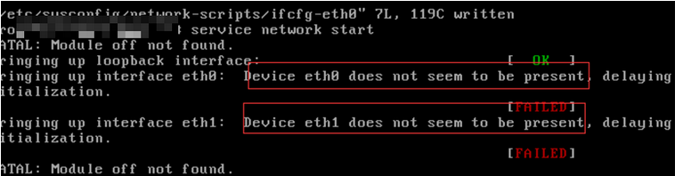

故障-启动网卡失败

问题症状

在服务器中，启动网卡提示如下信息。

Device eth0 does not seem to be present，delaying initialization

系统显示类似如下。

解决方案

执行如下命令，加载网卡模块。

modprobe xen-netfront

执行如下命令，重启网卡成功。

/etc/init.d/network restart

在/etc/rc.local中写入以上两条命令，设置开机启动。
