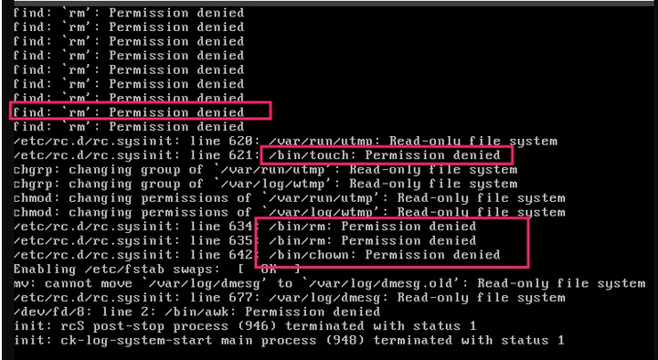
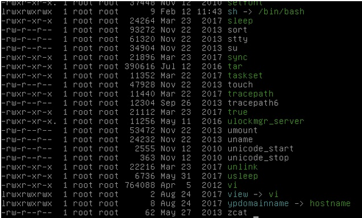

故障-系统无法正常启动

本文主要介绍/bin目录下命令权限异常导致Linux系统无法启动的解决方法。

问题症状

ECS实例启动后ping不通，SSH连接不上。通过
管理终端登录服务器查看系统，系统显示类似如下，没有正常启动的界面。

问题原因

从系统启动的异常信息中，可以看到很多命令没有执行权限。导致系统无法启动。

解决方案

验证是不是命令权限有问题。挂载LiveCD到服务器，执行 chroot命令到用户系统盘中。

执行如下命令，查看/bin目录下的文件权限。

ls -l /bin

系统显示类似如下，发现一些命令缺少执行权限。

创建系统盘快照备份。

执行如下命令，添加执行权限。

chmod +x /bin/\*

重启服务器，系统正常启动。
