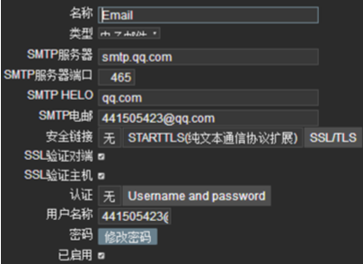
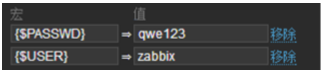

zabbix-agent端的配置

http://blog.chinaunix.net/uid-29155617-id-4668602.html \# agent配置说明  
https://www.cnblogs.com/saneri/p/7883275.html \# 自动发现

识别监控对象  
理解监控对象  
细分监控对象的指标  
确定监控的基准线

预中级  
工具化的监控分离  
监控对象的分类

1、硬件2、系统3、服务4、日志5、网络6、APM应用性能  
  
zabbix语言乱码问题  
find / -name \*font\* -print \|grep zabbix  
ll \`find / -name \*font\* -print \|grep zabbix\`  
/usr/share/fonts/dejavu/DejaVuSans.ttf \#这个文件控制字体的  
在win下找一个ttf的字体文件替换掉DejaVuSans.ttf就行了 注意备份  
https://www.cnblogs.com/cloudos/p/8297856.html  
https://www.cnblogs.com/likehua/p/3968689.html  
  
linux下agent配置  
  
https://www.cnblogs.com/liang-wei/p/5848923.html  
vi /etc/zabbix/zabbix_agentd.conf  
Server=192.168.21.70 \#zabbix服务端IP被动模式  
ServerActive=192.168.21.70 \#zabbix服务端IP主动模式  
Hostname=192.168.21.60 \#自己的地址  
  
win下agent配置监控  
LogFile=c:\\zabbix_agentd.log  
Server=192.168.21.70  
Hostname=192.168.21.60  
ServerActive=192.168.21.70  
cmd下注册服务  
-i --install  
-d --uninstall  
-s --start  
-x --stop  
-h --htlp  
-V --version  
c:\\zabbix\\bin\\win64\\zabbix_agentd.exe -c
c:\\zabbix\\conf\\zabbix_agentd.win.conf -i  
启动命令如下：  
c:\\zabbix\\bin\\win64\\zabbix_agentd.exe -c
c:\\zabbix\\conf\\zabbix_agentd.win.conf -s  
删除服务重新注册  
c:\\zabbix\\bin\\win64\\zabbix_agentd.exe -d -c
c:\\zabbix\\conf\\zabbix_agentd.win.conf  
  
用户自定义监控项和模板制作  
服务端安装检测工具  
yum install zabbix-get  
  
agent配置文件  
vi /etc/zabbix/zabbix_agentd.conf  
\# UserParameter=  
UserParameter=login-user,uptime \| awk -F ' ' ' {print \$5}' \#login-user唯一  
  
自定义监控模板位置  
/etc/zabbix/zabbix_agentd.d/  
[root\@node1 zabbix_agentd.d]\# cat TCP_status.conf  
UserParameter=TCP_status[\*],netstat -ant \|grep -c \$1  
/etc/init.d/zabbix-agent restart  
[root\@linux7 \~]\# zabbix_get -s 10.1.21.32 -k TCP_status[LISTEN]  
8  
测试  
  
上述添加完毕就在web界面主机添加自定义的监控项  
键值则为UserParameter=TCP_status[\*]里面的例如TCP_status[LISTEN]  
从而制作模板  
  
邮件报警  

  
配置邮件服务-用户邮箱地址-主机-监控项-触发器-动作-测试  
告警内容  
1. {ITEM.NAME1} ({HOST.NAME1}:{ITEM.KEY1}): {ITEM.VALUE1}  
2. {ITEM.NAME2} ({HOST.NAME2}:{ITEM.KEY2}): {ITEM.VALUE2}  
日期：{DATE}-{TIME}  
主机：{HOST.NAME}  
  
自定义报警脚本  
AlertScriptsPath=/usr/lib/zabbix/alertscripts \#默认脚本路径，放在该位置就可以
然后再报警媒介类型 调用  
需要在 报警媒介类型 用户 动作调用 才能成功完成报警  
  
立即刷新让重新加载  
[root\@linux7 \~]\# zabbix_server -R config_cache_reload  
zabbix_server [4114]: command sent successfully  
  
zabbix监控web监控url  
监控天气  
curl http://www.weather.com.cn/data/sk/101010100.html 2\>/dev/null \|python -m
json.tool  
  
监控mysql  
[root\@node1 \~]\# vim /etc/zabbix/zabbix_agentd.d/userparameter_mysql.conf
\#自带的监控格式参考  
带密码监控 把密码写入配置文件中  
UserParameter=mysql.ping,HOME=/var/lib/zabbix mysqladmin -uzabbix -pqwe123 ping
\| grep -c alive  
UserParameter=mysql.version,mysql -V  
变量带密码监控用于多数据库  
UserParameter=mysql.status[\*],echo "show global status where
Variable_name='\$1';" \| HOME=/var/lib/zabbix mysql -u\$2 -p\$3 -N \| awk
'{print \$\$2}' \#用变量表示 \$1被用  
UserParameter=mysql.ping[\*],HOME=/var/lib/zabbix mysqladmin -u\$2 -p\$3 ping \|
grep -c alive  
测试  
zabbix_get -s 10.1.21.32 -k mysql.status[zabbix,qwe123,Uptime]  
4210  
修改模板“宏”  

  
MySQL status 触发器 1 mysql.ping[{\$USER},{\$PASSWD}]  
MySQL uptime mysql.status[{\$USER},{\$PASSWD},Uptime]  
  
\# 通过percona监控MySQL  
https://www.cnblogs.com/wsl222000/p/5520081.html  
https://blog.csdn.net/qq_31613055/article/details/78781752  
/var/lib/zabbix/percona/templates \#percona下的mysql模板目录  
在zabbix客户端安装mysql监控插件rpm包  
  
rpm -ivh
https://www.percona.com/downloads/percona-monitoring-plugins/1.1.6/percona-zabbix-templates-1.1.6-1.noarch.rpm  
cd /var/lib/zabbix/percona/templates  
在zabbix监控页面中导入此模板文件zbx_percona_mysql_template.xml  
cp userparameter_percona_mysql.conf
/usr/local/zabbix/etc/zabbix_agentd.conf.d/　　\#(具体路径根据实际情况而定)  
  
修改MySQL的执行命令文件
/var/lib/zabbix/percona/scripts/get_mysql_stats_wrapper.sh  
  
RES=\`HOME=\~zabbix /usr/bin/mysql -uUSER -pPASS -e 'SHOW SLAVE STATUS\\G' \|
egrep '(Slave_IO_Running\|Slave_SQL_Running):' \| awk -F: '{print \$2}' \| tr
'\\n' ','\`  
修改
/var/lib/zabbix/percona/scripts/ss_get_mysql_stats.php文件，换成自己MySQL的用户名和密码  
  
\$mysql_user = 'USER';  
\$mysql_pass = 'PASS';  
重启zabbix-agent，在server上zabbix_get -s 10.1.21.32 -k MySQL.Open-files测试一下  
  
监控nginx  
  
zabbix2.0升级到3.0  
模板不兼容升级2.2到3.0，模板就跟着升级，然后再导出便是3.0的模板了  
修改yum源  
yum list \|grep zabbix \#查看包  
yum install zabbix-server-mysql zabbix-web-mysql -y  
  
自动发现  
[root\@node2 \~]\# cat /etc/zabbix/zabbix_agentd.conf \|grep "\^[a-Z]"  
PidFile=/var/run/zabbix/zabbix_agentd.pid  
LogFile=/var/log/zabbix/zabbix_agentd.log  
LogFileSize=0  
Server=10.1.21.20  
ServerActive=10.1.21.20  
HostnameItem=system.hostname  
Include=/etc/zabbix/zabbix_agentd.d/\*.conf  
直接在zabbix server端的/etc/hosts文件里添加客户端主机名和IP。  
这样获取到的主机名就是你定义的主机名了，而不是ip地址的。  
  
自动注册  
配置  
ServerActive=10.0.0.1  
如果你没有在zabbix_agentd.conf中特别定义了Hostname，则服务器将使用agent的系统主机名命名主机。Linux中的系统主机名可以通过运行'hostname'命令获得。  
修改配置后重启agent  
在Zabbix页面，转到配置→动作，选择自动注册为事件源，然后单击创建操作：  
在“动作“选项卡，定义 Action 名称  
可选指定条件。如果要使用“主机元数据”条件，请参阅下一节。  
在“操作”选项卡中，添加“添加主机”，“添加到主机组”（例如，发现的主机），“链接到模板”等。

zabbix-agent脚本配置

\#!/bin/sh  
cd /opt  
groupadd zabbix -g 201  
useradd -g zabbix -u 201 -m zabbix  
tar -zxf zabbix-2.2.2.tar.gz  
cd zabbix-2.2.2  
./configure --prefix=/usr/local/zabbix --sysconfdir=/etc/zabbix --enable-agent  
make  
make install  
mkdir /var/log/zabbix  
chown zabbix.zabbix /var/log/zabbix  
cp misc/init.d/fedora/core/zabbix_agentd /etc/init.d/  
chmod 755 /etc/init.d/zabbix_agentd  
cp /etc/zabbix/zabbix_agentd.conf /etc/zabbix/zabbix_agentd.conf.bak  
cd /etc/zabbix/ && rm -f zabbix_agentd.conf  
cp /opt/zabbix_agentd.conf .  
/bin/sed -i s/temp_hostname/\`/bin/hostname\`/g /etc/zabbix/zabbix_agentd.conf  
/bin/sed -i "s\#BASEDIR=/usr/local\#BASEDIR=/usr/local/zabbix\#g"
/etc/init.d/zabbix_agentd  
chkconfig zabbix_agentd on  
service zabbix_agentd restart
