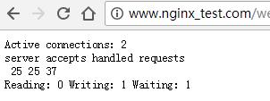
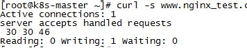
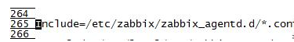

zabbix自定义监控nginx

安装nginx（agent端）

1、安装依赖

yum -y install gcc zlib zlib-devel pcre-devel openssl openssl-devel

2、添加Nginx仓库

vim /etc/yum.repos.d/nginx.repo

添加如下内容：

[nginx]

name=nginx repo

baseurl=http://nginx.org/packages/centos/7/\$basearch/

gpgcheck=0

enabled=1

3、安装nginx

yum install nginx -y

4、启动nginx

nginx

5、停止nginx

nginx -s stop

查看nginx是否安装监控模块（agent端）

nginx -V

注：模块名称为"--with-http_stub_status_module"

编译nginx主配置文件，添加状态监控信息（agent端）

vim /etc/nginx/nginx.conf

location /web_status {

stub_status on;

access_log off;

}

注：一定要在server标签下配置，"web_status"为自定义的名称。

配置之后，检查、平滑重启

nginx -t

nginx -s reload

访问status状态网页，查看状态信息（agent端）

www.nginx_test.com/web_status

字段说明：

第一个 server 表示Nginx启动到现在共处理了 25 个连接

第二个 accepts 表示Nginx启动到现在共成功创建 25 次握手

第三个 handled requests 表示总共处理了 37 次请求

请求丢失数 = 握手数 - 连接数 ，可以看出目前为止没有丢失请求

使用awk命令取值（agent端）

curl -s www.nginx_test.com/web_status

注：如果"curl -s www.nginx_test.com/web_status"无法取值，或者是出现"curl: (6)
Could not resolve host: nginx_test.com; Name or service not
known"的错误，在/etc/hosts中添加对应的解析关系即可！

配置脚本（agent端）

脚本可以自己写，这里我使用现成的。

wget http://fj.xuliangwei.com/zabbix/scripts/nginx_status.sh

取值

nginx_status.sh {active\|reading\|writing\|waiting\|accepts\|handled\|requests}

配置agent端（agent端）

vim /etc/zabbix/zabbix_agentd.conf

注：默认已经配置好了

自定义监控项（agent端）

1、进入如下目录

cd /etc/zabbix/zabbix_agentd.d/

2、创建nginx_status.conf文件（必须是.conf结尾），写入如下内容

UserParameter=nginx_status[\*],/bin/bash /etc/zabbix/scripts/nginx_status.sh
"\$1"

3、创建脚本目录，并拷贝监控脚本到该目录，并添加执行权限

mkdir scripts

wget http://fj.xuliangwei.com/zabbix/scripts/nginx_status.sh

chmod +x nginx_status.sh

4、重启zabbix-agent服务

systemctl restart zabbix-agent

服务器获取脚本值（server端）

zabbix_get -s 192.168.139.99 -p10050 -k nginx_status[active]

注："active"这个参数，为监控的取值参数，可以填写其他参数

取值的时候报了如下的错误：

zabbix_get [10738]: Check access restrictions in Zabbix agent configuration

原因是zabbix agent端没有指定服务器的地址，进入"vim
/etc/zabbix/zabbix_agentd.conf"将"Server=127.0.0.1"改为服务器地址"Server=192.168.139.58"，重启agent服务即可！

配置server监控项（server端）

1、进入"配置"、"模板"、"导入"，即可创建所有的监控项（导入的内容为zabbix的html文件）

zabbix自定义监控nginx

2、导入"tcp_status"的html文件

zabbix自定义监控nginx

3、将模板关联主机
