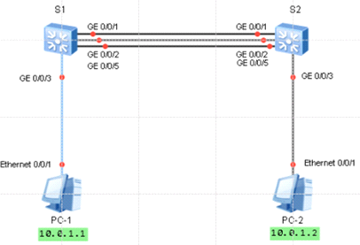

接口速率的配置方法

手动模式配置链路聚合的方法  
静态LACP模式配置链路聚合的方法  
静态LACP模式下配置接口优先级的方法  
  
接口速率配置  
华为交换机接口默认开启了自协商功能。在本任务中，需要手动配置S1与S2上G0/0/9和G0/0/10接口的速率。  
[sw1]dis int g 0/0/9  
在修改接口的速率之前应先关闭接口的自协商功能，然后将S1上的G0/0/9和G0/0/10接口的速率配置为100
Mbit/s。  
[S1]interface GigabitEthernet 0/0/9  
[S1-GigabitEthernet0/0/9]undo negotiation auto  
[S1-GigabitEthernet0/0/9]speed 100  
[S1-GigabitEthernet0/0/9]quit  
[S1]interface GigabitEthernet 0/0/10  
[S1-GigabitEthernet0/0/10]undo negotiation auto  
[S1-GigabitEthernet0/0/10]speed 100  
同样的方法将S2上的G0/0/9和G0/0/10接口的速率配置为100 Mbit/s。  
\<Quidway\>system-view  
[Quidway]sysname S2  
[S2]interface GigabitEthernet 0/0/9  
[S2-GigabitEthernet0/0/9]undo negotiation auto  
[S2-GigabitEthernet0/0/9]speed 100  
[S2-GigabitEthernet0/0/9]quit  
[S2]interface GigabitEthernet 0/0/10  
[S2-GigabitEthernet0/0/10]undo negotiation auto  
[S2-GigabitEthernet0/0/10]speed 100

配置eth-trunk 实现链路聚合 两种模式  
Eth-Trunk是一种捆绑技术，他将多个物理接口捆绑成一个逻辑接口，捆绑在一起的每个物理接口成为成员接口，主要用于  
负载分担：在一个eth-trunk接口内，可以实现流量负载分担  
提高可靠性：当某个成员接口连接的物理链路出现故障时，流量会切换到其他可用的链路上，从而提高整个trunk链路的可靠性  
增加带宽：trunk接口的总带宽是各成员接口带宽之和  
Eth-Trunk在逻辑上把多条物理链路捆绑等同于一条逻辑链路，对上层数据透明传输。所有Eth-Trunk中物理接口的参数必须一致，  
手工负载分担  
实验环境  

  
先将s1与s2上互联的g0/0/2和g0/0/5接口关闭,模拟只有一条链路的时候  
int g 0/0/2  
shutdown  
int g 0/0/5  
shutdown  
现在增加一条链路,带宽增加到2Gbit/s,在未配置Eth-Trunk时只有一条链路在工作,  
模拟开启两个g0/0/2接口  
int g 0/0/2  
undo shutdown  
增加链路后,  
dis stp brief \# 在两个交换上查看stp  
该拓扑默认开启STP协议,会阻塞一条链路  
  
链路聚合分两种  
配置Eth-Trunk实现链路聚合  
Eth-Trunk工作模式  
手工负载分担：手动创建链路聚合组，并配置多个接口加入到创建的Eth-Trunk中  
静态LACP：通过LACP协议协商Eth-Trunk参数后自主选择活动接口  
  
  
手工负载分担模式  
创建Eth-Trunk 1 接口，  
配置 sw1 sw2 同时执行命令 创建 eth-trunk 1 并加入接口  
int Eth-Trunk 1  
mode manual load-balance \#指定手工负载分担方式  
interface GigabitEthernet0/0/1  
eth-trunk 1  
interface GigabitEthernet0/0/2  
eth-trunk 1  
  
dis eth-trunk 1  
dis interface Eth-Trunk 1  
dis stp brief  
可以看到  
接口总带宽是,接口之和  
关闭一个接口模拟故障,ping测试

静态LACP模式  
https://www.cnblogs.com/GyForever1004/p/9238356.html  
假设一条出现故障，只有一条链路正常工作无法保证带宽，现在在部署一条链路作为备份链路，并采用静态LACP模式配置Eth-Trunk实现两条链路同时转发，一条链路备份，当其中一条转发链路出现问题时，备份链路可立即进行数据转发  
[s1]int Eth-Trunk 1  
[s1-Eth-Trunk1]mode lacp-static  
Error: Error in changing trunk working mode. There is(are) port(s) in the trunk.  
提示错误需要先将加入到eth-trunk接口下物理接口删除  
\# 然后在s1和s2上的Eth-Trunk 1接口下改为LACP模式，并将3个接口分别加入到Eth-Trunk
1 接口  
interface Eth-Trunk1  
mode lacp-static  
interface GigabitEthernet0/0/1  
eth-trunk 1  
interface GigabitEthernet0/0/2  
eth-trunk 1  
interface GigabitEthernet0/0/5  
eth-trunk 1  
  
最终配置 设置这些链路以负载分担的方式转发数据  
[sw1]dis current-configuration  
\#
配置接口的活动优先级将默认的32768改为100,目的是使g0/0/1\|g0/0/2接口成为活动状态使其成为主动端-值越低级别越高,并按照主动端设备来选择活动接口  
lacp priority 100  
\# 接口阀值改为2(默认活动接口最大阀值8)就是处于活动的接口  
interface Eth-Trunk1  
mode lacp-static  
max active-linknumber 2  
interface GigabitEthernet0/0/1  
eth-trunk 1  
\#
在s1上配置接口的优先级确定活动链路,配置接口的活动优先级将默认的32768改为100.使g0/0/1和g0/0/2接口成为活动状态  
lacp priority 100  
interface GigabitEthernet0/0/2  
eth-trunk 1  
lacp priority 100  
interface GigabitEthernet0/0/5  
eth-trunk 1  
  
  
[sw2]dis current-configuration  
interface Eth-Trunk1  
mode lacp-static  
interface GigabitEthernet0/0/1  
eth-trunk 1  
lacp priority 100  
interface GigabitEthernet0/0/2  
eth-trunk 1  
lacp priority 100  
interface GigabitEthernet0/0/5  
eth-trunk 1  
  
测试  
dis eth-trunk 1 \#查看状态  
关闭s1 的g0/0/1 测试 g0/0/5处于活动  
开启s1 的g0/0/1 测试 g0/0/5处于不活动  
PS  
1 只能删除不包含任何成员接口的聚合口  
2 二层聚合口成员也必须为2层 3层为3层  
3 最多可以加入8个成员端口  
4 加入到聚合口的接口必须是hybrid接口类型  
5 不能嵌套使用聚合口  
6 一个成员接口只能属于一个聚合口  
7 聚合口的成员口类型必须相同  
8 两端都要配置聚合口  
9 R1====R2速率较低的接口可能拥塞或者丢包  
10有聚合口来学习MAC地址,成员端口就不再学习MAC  
  
  
查看ID为10的Eth-Trunk接口（LACP模式）的配置信息。  
\<HUAWEI\> display eth-trunk 10  
Eth-Trunk10's state information is:  
Local:  
LAG ID: 10 WorkingMode: LACP  
  
  
查看 Eth-Trunk 的成员接口信息  
\# 查看ID为2的Eth-Trunk的成员接口信息。  
\<HUAWEI\> display trunkmembership eth-trunk 2  
  
查看设备支持的链路聚合组数目和成员接口数目  
说明  
V200R005及以后版本支持此命令。  
\# 查看设备支持的链路聚合组数目和成员接口数目。  
\<HUAWEI\> display trunk configuration  
  
Item Default Current Configured  
  
trunk-group 128 64 64  
trunk-member 8 16 16  
\# display trunk configuration 命令输出信息描述  
Item \# 项目名称。  
Default \# 设备缺省情况下支持的Eth-Trunk的规格。  
Current \# 设备当前支持的Eth-Trunk的规格。  
Configured \# 设备当前配置的Eth-Trunk的规格，若与Current列不同，则  
在重启设备后Configured列配置生效。  
trunk-group \# 设备支持的Eth-Trunk组的数目。  
trunk-member \# 每个Eth-Trunk组支持的成员接口数。
