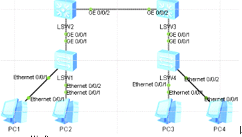

GVRP基础协议

动态注册vlan  
手工配置为静态vlan  
GVRP协议创建的为动态vlan  
三中注册模式  
Normal:允许该接口动态注册,注销  
Fixed:禁止该接口动态注册,注销,只传播静态vlan信息,  
Forbidden:禁止该接口动态注册,注销vlan,不传播任何除vlan1以外任何vlan信息  
  
环境  

  
Normal模式  
配置除接PC外交换机接口为trunk  
SW1接PC口为access创建vlan batch 10 20 加入相应vlan  
  
在所有交换上开启GVRP功能,并在交换两两互联接口下也开启GVRP功能,注册模式为Normal模式  
[s1]gvrp  
[s1]int g 0/0/1  
[sw2-GigabitEthernet0/0/1]gvrp  
完成注册查看vlan信息  
可看见都动态获取了vlan 但是只接收到了注册信息,此时只完成了单向注册  
配置GVRP双向注册  
在S4创建vlan 10 20 把接入PC口改为access口  
S2 S3上查看vlan 接收到vlan信息,完成双向注册  
dis gvrp statistics \#查看  
  
Fixed模式  
把s3的接口改为fixed模式  
[sw3]int g 0/0/1  
[sw3-GigabitEthernet0/0/1]gvrp registration fixed  
此时已经无法动态学习到vlan信息 修改回normal模式即可  
  
Forbidden模式  
修改sw2的接为forbidden模式  
[sw2]int g 0/0/1  
[sw2-GigabitEthernet0/0/1]gvrp registration forbidden  
并没有加入vlan  
现在手动创建vlan batch 10 20  
还是拒绝他只允许vlan1经过
