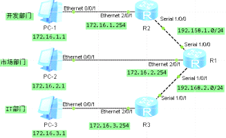
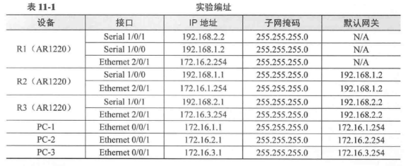
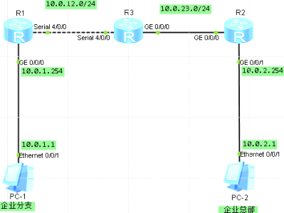
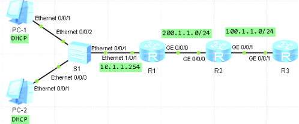

广域网

WAN接入设置

配置r1 r2 r3路由表 使网络互通  
配置ppp  
[r1]dis int Serial 1/0/0 \#默认协议为PPP  
配置HDLC  
在r1和r3的s 1/0/1接口上分别使用link-protocol命令配置链路层协议为HDLC  
int s 1/0/1  
link-protocol hdlc  
Warning: The encapsulation protocol of the link will be changed. Continue? [Y/N]  
:y  
然后测试

PPP的认证

PPP PAP认证

配置OSPF  
配置PPP的PAP认证  
在分支网关设备r1与公司核心设备r3上部署PPP的PAP认证，r3作为认证路由器，r1作为被认证路由器，总部设备r3上使用
ppp authentication-mode命令设置本端PPP协议  
对对段设备的认证方式PAP，认证采用的域名为huawei  
r3  
interface Serial4/0/0  
ppp authentication-mode pap domain huawei  
配置认证路由器R3的本地认证信息  
执行aaa命令  
[r3]aaa  
创建认证方案huawei_1，并进入认证方案视图  
[r3-aaa]authentication-scheme huawei_1  
配置认证模式为本地认证  
[r3-aaa-authen-huawei_1]authentication-mode local  
创建域huaweiyu  
[r3-aaa]domain huaweiyu  
配置域认证方案为huawei_1，需要和创建认证方案一致  
[r3-aaa-domain-huaweiyu]authorization-scheme huawei_1  
返回到aaa视图，配置村粗在本地，为对端认证放使用的用户名密码  
[r3-aaa]local-user r1\@huaweiyu password cipher huawei1  
[r3-aaa]local-user r1\@huaweiyu service-type ppp  
[r3]int s 4/0/0  
[r3-Serial4/0/0]shutdown  
[r3-Serial4/0/0]undo shutdown  
测试不通  
现在在r1上配置  
[r1]int s 4/0/0  
[r1-Serial4/0/0]ppp pap local-user r1\@huaweiyu password cipher huawei1  
测试通过

配置PPP的CHAP认证  
删除原有的PAP认证配置  
[r3-Serial4/0/0]undo ppp authentication-mode  
[r1-Serial4/0/0]undo ppp pap local-user  
删除后，在认证设备r3的s 4/0/0接口下配置PPP的认证方式CHAP  
[r3-Serial4/0/0]ppp authentication-mode chap  
[r3]aaa  
[r3-aaa]local-user r1 password cipher huawei1  
[r3-aaa]local-user r1 service-type ppp  
目前不通  
配置r1上的用户名密码  
int s 4/0/0  
ppp chap user r1  
ppp chap password huawei1  
测试

DHCP  
基于接口地址池的DHCP  
开启dhcp服务  
排除地址  
租期期限为2天  
dhcp enable \#开启dhcp服务  
interface GigabitEthernet0/0/0  
dhcp select interface  
dhcp server excluded-ip-address 192.168.1.1 192.168.1.100  
dhcp server excluded-ip-address 192.168.1.201 192.168.1.253  
dhcp server lease day 2 hour 0 minute 0  
dhcp server dns-list 8.8.8.8

配置基于全局地址池DHCP  
dhcp enable  
创建全局地址池  
ip pool huawei1  
gateway-list 192.168.1.254  
network 192.168.1.0 mask 255.255.255.0  
excluded-ip-address 192.168.1.250 192.168.1.253  
lease day 2 hour 0 minute 0  
dns-list 8.8.8.8  
开启接口DHCP功能  
[r1]int g 0/0/0  
[r1-GigabitEthernet0/0/0]dhcp select global  
  
路由器需要为两个不同部门分配IP地址，需要两个全局  
ip pool huawei2  
gateway-list 192.168.2.254  
network 192.168.2.0 mask 255.255.255.0  
excluded-ip-address 192.168.2.250 192.168.2.253  
lease day 2 hour 0 minute 0  
dns-list 8.8.8.8  
[r1]int g 0/0/1  
[r1-GigabitEthernet0/0/1]dhcp select global

DHCP中继 可跨路由跨网段获取DHCP

搭建ospf网络  
配置DHCP服务器  
r3创建全局地址池dhcp-pool  
分配地址范围
10.1.1.0/24，网关10.1.1.254，并在面向DHCP中继设备的接口上开启DHCP服务功能  
dhcp enable  
ip pool dhcp-pool  
gateway-list 10.1.1.254  
network 10.1.1.0 mask 255.255.255.0  
interface GigabitEthernet0/0/1  
ip address 100.1.1.1 255.255.255.0  
dhcp select global  
配置DHCP中继  
两种  
一种是面向PC的接口下配置DHCP服务器IP地址  
直接在R1的E0/0/1接口下开启DHCP中继功能，并制定DHCP服务器的IP地址为100.1.1.1  
r1  
interface Ethernet1/0/1  
ip address 10.1.1.254 255.255.255.0  
dhcp select relay  
dhcp relay server-ip 100.1.1.1  
另一种是面向PC接口下调用全局定义的DHCP服务器组  
[r1]dhcp server group dhcp-group  
[r1-dhcp-server-group-dhcp-group]dhcp-server 100.1.1.1  
[r1-dhcp-server-group-dhcp-group]int e 1/0/1  
[r1-Ethernet1/0/1]dhcp select relay  
[r1-Ethernet1/0/1]dhcp relay server-select dhcp-group

配置SNMP服务  
agent配置启用snmp版本v3  
snmp-agent  
snmp-agent sys-info version v3  
配置基本ACL控制，限制NMS-2管理设备，NMS-1不允许管理设备  
acl 2000  
rule 5 permit source 10.1.1.2 0.0.0.255  
rule 10 deny source 10.1.1.1 0.0.0.255  
配置用户组为group 用户名user 指定acl2000  
snmp-agent usm-user v3 user group acl 2000  
配置向SNMPagent暑促trap信息  
配置agent发送trap，用于接收该trap消息的网管名为adminNMS2，目的地址为10.1.1.2，且指定接收该消息使用UDP-9991，trap消息发送名称为NMS2  
snmp-agent target-host trap-hostname adminNMS2 address 10.1.1.2 udp-port 9991
trap-paramsname trapNMS2  
开启设备警告开关  
snmp-agent trap enable  
配置告警消息的队列长度为200（默认100），防止丢包  
snmp-agent trap queue-size 200  
设置报文消息保存时间240（默认120）  
snmp-agent trap life 240  
设置管理员联系方式  
snmp-agent sys-info contact call admin 400-8229999
