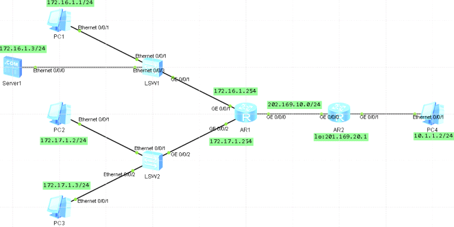

配置NAT

NAT是将IP数据报文报头中的IP地址转换为另一个IP地址的过程，主要用于实现内部网络（私有IP地址）访问外部网络（共有IP地址）的功能，NAT有3种类型：静态NAT、动态地址NAT和网络地址端口转换NAPT  
NAT转换设备（实现NAT功能）  
理解NAT的应用场景  
掌握静态NAT的配置  
掌握NAT outbound的配置  
掌握NAT Easy-IP的配置  
掌握NAT Server的配置

实验  
模拟企业网络场景，R1是公司出口网关路由器，公司内员工和服务器通过交换机S1或S2连接到R1上，R2模拟外网设备与R1直连。内网使用私网IP地址，实现公司内部分员工可以访问外网，
服务器可提供外网用户访问，在r1上配置NAT使用静态NAT和NAT
outbound技术是员工访问外网，使用NAT Server技术使服务器可以提供外网用户访问  

  
基础地址配置IP地址

配置静态NAT  
在公司内网网关上r1配置访问外网的默认路由
因为内网使用的都是私有IP地址，员工无法直接访问公网。现需要在网关路由器R1上配置NAT地址转换，将私网地址转换成公网地址。  
PC1配置为自身能访问外网，而且外网用户也能直接访问他，所以配置一个公网IP地址202.169.10.5给PC1做  
静态NAT地址转换  
在g0/0/0接口下nat static命令配置地址内部到外部地址的一对一转换  
[ar1-GigabitEthernet0/0/0]dis th  
[V200R003C00]  
\#  
interface GigabitEthernet0/0/0  
ip address 202.169.10.1 255.255.255.0  
nat static global 202.169.10.5 inside 172.16.1.1 netmask 255.255.255.255  
查看静态NAT配置信息，已经成功把源地址转换成目标地址  
[ar1-GigabitEthernet0/0/0]dis nat static  
Static Nat Information:  
Interface : GigabitEthernet0/0/0  
Global IP/Port : 202.169.10.5/----  
Inside IP/Port : 172.16.1.1/----

配置NAT outbound  
公司内部员工需要能上互联网，使用私网地址访问公网，并且配置地址池202.169.10.50\~202.169.10.60为NAT转换  
配置地址池  
在R1上使用 nat addres-group命令配置NAT地址池，起始和结束地址  
[ar1]nat address-group 1 202.169.10.50 202.169.10.60  
创建基本ACL2001，匹配20.1.1.0，掩码为24位的地址段  
[ar1]acl 2001  
[ar1-acl-basic-2001]rule 5 permit source 172.17.1.0 0.0.0.255  
在g0/0/0接口下使用nat
outbound命令将ACL2001与地址池相关联，使ACL中规定的地址可以使用地址池进行地址转换  
[ar1]int g 0/0/0  
[ar1-GigabitEthernet0/0/0]nat outbound 2001 address-group 1 no-pat  
然后查看NAT outbound信息  
[ar1]dis nat outbound

配置NAT Easy-IP（常用）  
目前常用，可以使用多对一的方式实现员工访问外网的需求  
Easy-IP是NAPT的一种方式，直接借用路由器出接口IP地址作为公网地址，将不同的内部地址映射到同一公有地址的不同端口号上，实现多对一地址转换，  
删除之前配置的NAT outbound配置，并使用nat
outbound命令配置Easy-IP特性，直接使用接口IP地址作为NAT转换后的地址  
直接使用路由器出口IP实现NAT地址转换  
直接定义私网地址范围  
[R1]acl 2000  
[R1-acl-basic-2000]rule permit source 10.1.1.1 0.0.0.0  
[R1-acl-basic-2000]rule permit source 10.1.1.2 0.0.0.0  
[R1-acl-basic-2000]rule permit source 10.1.1.3 0.0.0.0  
[R1-acl-basic-2000]quit  
[R1]int g0/0/1  
[R1-GigabitEthernet0/0/1]nat outbound 2000  
[R1-GigabitEthernet0/0/1]quit  
  
在PC上配置UDP发包，在r1上验证信息  
[ar1]dis nat session protocol udp verbose

配置NAT Server  
公司内服务器提供ftp服务供外网访问，配置NAT服务并使用外网地址202.169.10.6  
对外公布服务器地址，然后开启NAT
ALG功能。因为对于封装在IP数据报文中的应用层协议报文，正常的NAT转换会导致错误，在开启某应用协议的NAT
ALG功能后，该应用协议保温可以正常进行NAT转换，否则该应用协议不能正常工作  
在R1的G0/0/0接口上，使用NAT
server命令定义内部服务器的映射表，指定服务器通信协议类型为TCP，配置服务器使用的公网IP地址为202.169.10.6，服务器内网地址为172.16.1.3，指定端口号为21，该常用端口号可以直接使用关键字FTP代替  
[ar1-GigabitEthernet0/0/0]nat server protocol tcp global 202.169.10.6 ftp inside
172.16.1.3 ftp  
[ar1]nat alg ftp enable  
[ar1]dis nat server \# 查看转换信息  
  
Nat Server Information:  
Interface : GigabitEthernet0/0/0  
Global IP/Port : 202.169.10.6/21(ftp)  
Inside IP/Port : 172.16.1.3/21(ftp)  
Protocol : 6(tcp)  
VPN instance-name : ----  
Acl number : ----  
Description : ----  
  
Total : 1
