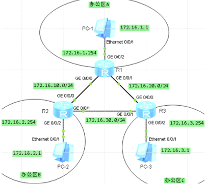
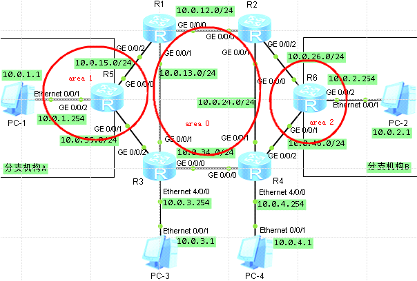
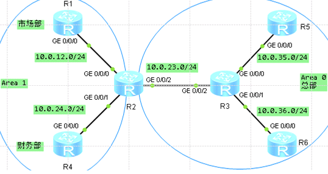
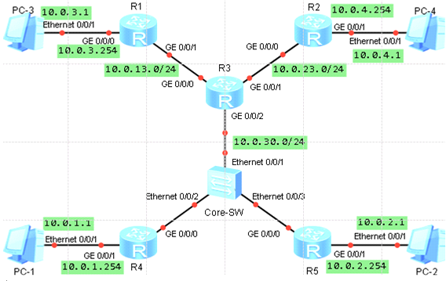
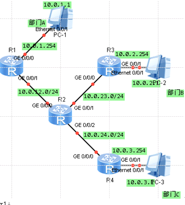
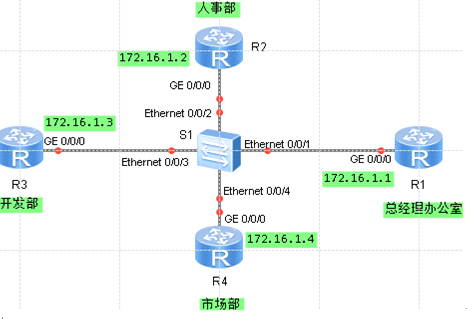
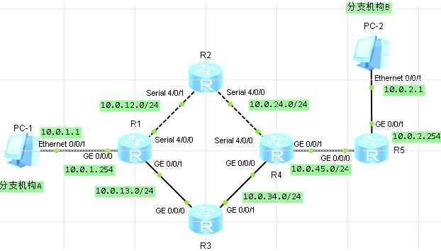
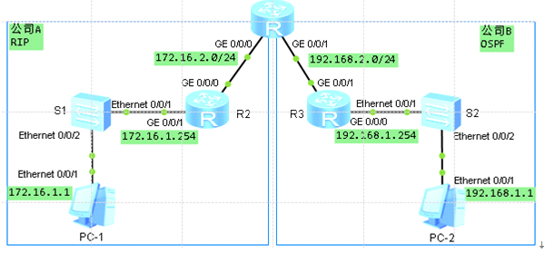
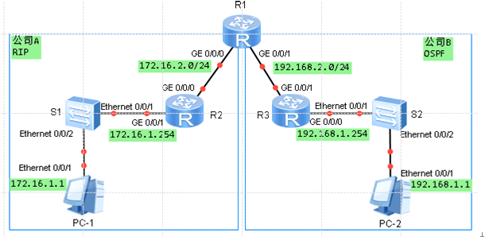

OSPF配置

OSPF支持区域划分，区域是从逻辑上将路由器划分为不同的组，每个组用区域（Area
ID）来标识。一个网段（链路）只能属于一个区域，或者说每个运行OSPF的接口必须指明属于哪一个区域。区域0为骨干区域，骨干区域负责在非骨干区域之间发布区域间的路由信息。在一个OSPF区域中有且只有一个骨干区域。  
  
OSPF单区域配置  
规划  

  
  
配置地址测试路由间链路  
  
配置OSPF  
  
r1  
\# 代表进程号，没写默认为1  
ospf 1  
\# 单区域配置，使用骨干区域，区域为0  
area 0.0.0.0  
\# 精准匹配通告网段  
network 172.16.1.0 0.0.0.255  
network 172.16.10.0 0.0.0.255  
network 172.16.20.0 0.0.0.255  
r2  
ospf 1  
area 0.0.0.0  
network 172.16.2.0 0.0.0.255  
network 172.16.10.0 0.0.0.255  
network 172.16.30.0 0.0.0.255  
r3  
ospf 1  
area 0.0.0.0  
network 172.16.3.0 0.0.0.255  
network 172.16.20.0 0.0.0.255  
network 172.16.30.0 0.0.0.255

查看OSPF邻居状况  
dis ospf peer  
查看OSPF路由  
dis ip routing-table protocol ospf  
测试PC链路

在ospf单区域中，每台路由器都需要收集其他所有路由器的链路状态信息，如果网络规模不断扩大，链路状态信息也会随之不断增多，这将使得单台路由器上链路状态数据库非常庞大，导致路由器负担加重，也不便于维护管理。为解决上述问题，OSPF协议可以将整个自治系统划分为不同区域（Area）  
链路状态信息只在区域内泛洪，区域之间传递的知识路由条目而非链路状态信息，因此大大减小了路由器的负担，当一台路由器属于不同区域时称他为区域边界路由器（Area
Border
Router，ABR），负责传递区域间路由信息。区域间的路由信息传递类似距离矢量算法，为了防止区域间产生环路，所有非骨干区域之间的路由信息必须经过骨干区域，也就是说非骨干区域必须和骨干区域相连，而且非骨干区域之间不能直接进行路由信息交互  
OSPF多区域配置  

sysname R1  
interface GigabitEthernet0/0/0  
ip address 10.0.12.1 255.255.255.0  
interface GigabitEthernet0/0/1  
ip address 10.0.13.1 255.255.255.0  
interface GigabitEthernet0/0/2  
ip address 10.0.15.1 255.255.255.0  
  
sysname R2  
interface GigabitEthernet0/0/0  
ip address 10.0.12.2 255.255.255.0  
interface GigabitEthernet0/0/1  
ip address 10.0.24.2 255.255.255.0  
interface GigabitEthernet0/0/2  
ip address 10.0.26.2 255.255.255.0  
  
sysname R3  
interface Ethernet4/0/0  
ip address 10.0.3.254 255.255.255.0  
interface GigabitEthernet0/0/0  
ip address 10.0.34.3 255.255.255.0  
interface GigabitEthernet0/0/1  
ip address 10.0.13.3 255.255.255.0  
interface GigabitEthernet0/0/2  
ip address 10.0.35.3 255.255.255.0  
  
sysname R4  
interface Ethernet4/0/0  
ip address 10.0.4.254 255.255.255.0  
interface GigabitEthernet0/0/0  
ip address 10.0.34.4 255.255.255.0  
interface GigabitEthernet0/0/1  
ip address 10.0.24.4 255.255.255.0  
interface GigabitEthernet0/0/2  
ip address 10.0.46.4 255.255.255.0  
  
sysname R5  
interface GigabitEthernet0/0/0  
ip address 10.0.15.5 255.255.255.0  
interface GigabitEthernet0/0/1  
ip address 10.0.35.5 255.255.255.0  
interface GigabitEthernet0/0/2  
ip address 10.0.1.254 255.255.255.0  
  
sysname R6  
interface GigabitEthernet0/0/0  
ip address 10.0.26.6 255.255.255.0  
interface GigabitEthernet0/0/1  
ip address 10.0.46.6 255.255.255.0  
interface GigabitEthernet0/0/2  
ip address 10.0.2.254 255.255.255.0

配置r1 r2 r3 r4骨干区域路由，并在骨干区域0视图下通告总部各网段  
r1  
ospf 1  
area 0  
network 10.0.12.0 0.0.0.255  
network 10.0.13.0 0.0.0.255  
r2  
ospf 1  
area 0  
network 10.0.12.0 0.0.0.255  
network 10.0.24.0 0.0.0.255  
r3  
ospf 1  
area 0  
network 10.0.13.0 0.0.0.255  
network 10.0.34.0 0.0.0.255  
network 10.0.3.0 0.0.0.255  
r4  
ospf 1  
area 0  
network 10.0.34.0 0.0.0.255  
network 10.0.24.0 0.0.0.255  
network 10.0.4.0 0.0.0.255

查看OSPF路由  
[R3-ospf-1]dis ip routing-table protocol ospf

配置r5进入区域1，并通告分支A相应网段 r6进入区域2通告分支 非骨干路由  
配置非骨干路由  
r5  
ospf 1  
area 1  
network 10.0.15.0 0.0.0.255  
network 10.0.35.0 0.0.0.255  
network 10.0.1.0 0.0.0.255  
r1  
ospf  
area 1  
network 10.0.15.0 0.0.0.255  
r3  
ospf 1  
area 1  
network 10.0.35.0 0.0.0.255  
r6  
ospf 1  
area 2  
network 10.0.26.0 0.0.0.255  
network 10.0.46.0 0.0.0.255  
network 10.0.2.0 0.0.0.255  
r2  
ospf 1  
area 2  
network 10.0.26.0 0.0.0.255  
r4  
ospf 1  
area 2  
network 10.0.46.0 0.0.0.255

查看链路状态数据库信息  
[R5]dis ospf lsdb  
测试

OSPF支持报文验证功能，只有通过验证的报文才能接收，否则将不能正常建立邻居关系。ospf协议支持两种认证方式--区域认证和链路认证。使用区域认证时，一个区域中所有的路由器在该区域下的认证模式和口令必须一致；OSPF链路认证相比区域认证更加灵活，可以专门针对某个邻居设置单独的认证模式和密码。如果同时配置接口认证和区域认证时，优先使用接口认证建立OSPF邻居。  
每种认证方式又分为简单验证、MD5验证和KEY
chain验证，简单验证明文传输，MD5验证为加密，key
chain验证可以同时配置多个密钥，不同密钥可以单独设置生效周期  
配置OSPF认证  
规划  

  
  
搭建OSPF环境

r1  
ospf 1  
area 0.0.0.1  
network 1.1.1.1 0.0.0.0  
network 10.0.12.0 0.0.0.255  
r2  
ospf 1  
area 0.0.0.0  
network 2.2.2.2 0.0.0.0  
network 10.0.23.0 0.0.0.255  
area 0.0.0.1  
network 10.0.12.0 0.0.0.255  
network 10.0.24.0 0.0.0.255  
r3  
ospf 1  
area 0.0.0.0  
network 3.3.3.3 0.0.0.0  
network 10.0.23.0 0.0.0.255  
network 10.0.35.0 0.0.0.255  
network 10.0.36.0 0.0.0.255  
r4  
ospf 1  
area 0.0.0.1  
network 4.4.4.4 0.0.0.0  
network 10.0.24.0 0.0.0.255  
r5  
ospf 1  
area 0.0.0.0  
network 5.5.5.5 0.0.0.0  
network 10.0.35.0 0.0.0.255  
r6  
ospf 1  
area 0.0.0.0  
network 6.6.6.6 0.0.0.0  
network 10.0.36.0 0.0.0.255

环回口为方便测试OSPF是否能通信  
配置公司分部OSPF区域明文认证  
r1上OSPF1下authentication-mode命令，配置简单认证  
模式为simple 口令huawei1  
配置plain参数 口令以明文方式显示  
r1  
ospf 1  
area 1  
authentication-mode simple plain huawei1  
dis this \# 查看为明文显示  
authentication-mode simple huawei1  
dis this \# 查看为密文显示  
  
dis ospf peer brief \#查看邻居关系  
  
配置公司总部OSPF密文md5认证  
总部OSPF区域为0 认证模式md5 认证标识符为1 口令为huawei3  
r2  
ospf 1  
area 0  
authentication-mode md5 1 huawei3  
r3 r5 r6相同  
[r3-ospf-1]dis ospf peer brief  
  
现提高安全同样使用md5模式链路认证  
在r2的g0/0/1接口下使用  
[R2]int g 0/0/1  
[R2-GigabitEthernet0/0/1]ospf authentication-mode md5 1 huawei5  
r4的g0/0/0接口下同样配置  
dis ospf peer brief \#查看建立邻居的邻居关系

OSPF被动接口配置  
ospf被动接口也称抑制接口，成为被动接口后，将不会接收和发送ospf报文。如果要使OSPF路由信息不被某一网络中的路由器获得且使本地路由器不接收网络中其他路由器发布的路由更新信息，即已运行在OSPF协议进程中的借口不与本链路上其余路由器建立邻居关系时，可通过配置被动接口来禁止此接口接收和发送OSPF报文。  

  
  
配置地址和搭建ospf环境，所有接口都运行在区域0内

r1  
interface GigabitEthernet0/0/0  
ip address 10.0.3.254 255.255.255.0  
\#  
interface GigabitEthernet0/0/1  
ip address 10.0.13.1 255.255.255.0  
\#  
interface GigabitEthernet0/0/2  
\#  
interface NULL0  
\#  
ospf 1  
area 0.0.0.0  
network 10.0.3.0 0.0.0.255  
network 10.0.13.0 0.0.0.255  
r2  
interface GigabitEthernet0/0/0  
ip address 10.0.23.2 255.255.255.0  
\#  
interface GigabitEthernet0/0/1  
ip address 10.0.4.254 255.255.255.0  
\#  
interface GigabitEthernet0/0/2  
\#  
interface NULL0  
\#  
ospf 1  
area 0.0.0.0  
network 10.0.4.0 0.0.0.255  
network 10.0.23.0 0.0.0.255  
r3  
interface GigabitEthernet0/0/0  
ip address 10.0.13.3 255.255.255.0  
\#  
interface GigabitEthernet0/0/1  
ip address 10.0.23.3 255.255.255.0  
\#  
interface GigabitEthernet0/0/2  
ip address 10.0.30.3 255.255.255.0  
\#  
interface NULL0  
\#  
ospf 1  
area 0.0.0.0  
network 10.0.13.0 0.0.0.255  
network 10.0.23.0 0.0.0.255  
network 10.0.30.0 0.0.0.255  
r4  
interface GigabitEthernet0/0/0  
ip address 10.0.30.4 255.255.255.0  
\#  
interface GigabitEthernet0/0/1  
ip address 10.0.1.254 255.255.255.0  
\#  
interface GigabitEthernet0/0/2  
\#  
interface NULL0  
\#  
ospf 1  
area 0.0.0.0  
network 10.0.1.0 0.0.0.255  
network 10.0.30.0 0.0.0.255  
r5  
interface GigabitEthernet0/0/0  
ip address 10.0.30.5 255.255.255.0  
\#  
interface GigabitEthernet0/0/1  
ip address 10.0.2.254 255.255.255.0  
\#  
interface GigabitEthernet0/0/2  
\#  
interface NULL0  
\#  
ospf 1  
area 0.0.0.0  
network 10.0.2.0 0.0.0.255  
network 10.0.30.0 0.0.0.255

在PC1上抓包，网关路由器不停的向这条线路发送ospf的hello报文尝试发现邻居对于pc而言毫无用处  
所以配置被动接口  
[r4]ospf 1  
[r4-ospf-1]silent-interface GigabitEthernet 0/0/1  
再次抓包就没了  
如果R4上有多个接口需要设置为被动接口，只有G0/0/1接口保持活动状态，可以简化命令  
[r4]ospf 1  
[r4-ospf-1]silent-interface all  
[r4-ospf-1]undo silent-interface GigabitEthernet 0/0/1  
第一个是对某一个接口进行被动操作；而第二种是在对所有接口配置为被动接口后，在排除不需要配置为被动接口的接口；  
其他网关上同样配置  
然后测试

理解ospf router-ID  
动态路由协议需要route-id作为路由器身份标识  
启动这些路由协议时没有制定route-id，则默认使用路由器全局下的路由挂历route-id  
这个命令就是用来手动设置router-id的，形式同ip地址，ospf中不要求该路由器存在该IP并可在网络上通信。  
如果不打这个命令，路由器就会根据一套规则选出router-id，1、最小的LoopBack
地址作为ID(如loopback0)，  
如果没有loopback，那么在路由器接口中选择最大的IP地址作为ID。  
建议手动配置，不然你做一个设备上的网络改动会造成OSPF区域的路由动荡。  

r1  
interface GigabitEthernet0/0/0  
ip address 10.0.1.254 255.255.255.0  
\#  
interface GigabitEthernet0/0/1  
ip address 10.0.12.1 255.255.255.0  
\#  
interface GigabitEthernet0/0/2  
\#  
interface NULL0  
\#  
interface LoopBack0  
ip address 1.1.1.1 255.255.255.255  
\#  
ospf 1 router-id 1.1.1.1  
area 0.0.0.0  
network 10.0.1.0 0.0.0.255  
network 10.0.12.0 0.0.0.255  
  
r2  
interface GigabitEthernet0/0/0  
ip address 10.0.12.2 255.255.255.0  
\#  
interface GigabitEthernet0/0/1  
ip address 10.0.23.2 255.255.255.0  
\#  
interface GigabitEthernet0/0/2  
ip address 10.0.24.2 255.255.255.0  
\#  
interface NULL0  
\#  
interface LoopBack0  
ip address 2.2.2.2 255.255.255.255  
\#  
ospf 1 router-id 2.2.2.2  
area 0.0.0.0  
network 10.0.12.0 0.0.0.255  
network 10.0.23.0 0.0.0.255  
network 10.0.24.0 0.0.0.255  
r3  
interface GigabitEthernet0/0/0  
ip address 10.0.23.3 255.255.255.0  
\#  
interface GigabitEthernet0/0/1  
ip address 10.0.2.254 255.255.255.0  
\#  
interface GigabitEthernet0/0/2  
\#  
interface NULL0  
\#  
interface LoopBack0  
ip address 3.3.3.3 255.255.255.255  
\#  
ospf 1 router-id 3.3.3.3  
area 0.0.0.0  
network 3.3.3.3 0.0.0.0  
network 10.0.2.0 0.0.0.255  
network 10.0.23.0 0.0.0.255  
r4  
interface GigabitEthernet0/0/0  
ip address 10.0.24.4 255.255.255.0  
\#  
interface GigabitEthernet0/0/1  
ip address 10.0.3.254 255.255.255.0  
\#  
interface GigabitEthernet0/0/2  
\#  
interface NULL0  
\#  
interface LoopBack0  
ip address 4.4.4.4 255.255.255.255  
\#  
ospf 1 router-id 4.4.4.4  
area 0.0.0.0  
network 10.0.3.0 0.0.0.255  
network 10.0.24.0 0.0.0.255

OSPF协议的route-idI必须唯一  
dis ospf 1 lsdb \#查询  
\<r1\>reset ospf process \#重启ospf协议  
dis ip routing-table protocol ospf \#查看邻居关系

OSPF的DR与BDR  
在OSPF的广播类型网络和NBMA类型网络中，如果网络中有N台路由器，若任意两台路由器之间都要建立邻居关系，则需要建立N\*（N-1）/2个邻居关系，即当路由器很多时，则需要建立和维护的邻居关系就很多，两两之间需要发送的报文也就很多，这会造成很多内容重复的报文在网络中传递，浪费了设备的带宽资源。因此在广播和NBMA类型网络中，OSPF协议定义了指定路由器DR（Designated
Router），即所有其他路由器都只将各自的链路状态信息发送给DR，在由DR以组播方式发送给所有路由器，大大减少了OSPF数据包的发送  
但是如果DR由于某种故障而失效，此时网络中必须重新选举DR，并同步链路状态信息，这需要较长时间，为了能够缩短这个过程，OSPF协议又定义了BDR（Backup
Designated
Router）的概念，作为DR路由器的备份，当DR路由器失效时，BDR成为DR，并再选择新的BDR路由器。其他非DR/BDR路由器都成为DR
Other路由器。  
每一个含有至少两个路由器的广播类型网络或NBMA类型网络都会选举一个DR和BDR。选举规则是首先比较DR优先级，优先级高者成为DR，次高的成为BDR。如果优先级相等，则Router-ID数值高的成为DR，次高的成为BDR。如果一台路由器的DR优先级为0，则不参与选举。需要注意的是，DR是在某个广播或者NBMA网段内进行选举的，是针对路由器的接口而言的。某台路由器在一个接口上可能是DR，在另一个接口上可能是BDR，或者是DR
Other  
若DR、BDR已经选举完毕，人为修改任何一台路由器的DR优先级值为最大，也不会抢占成为新的DR或者BDR，即ospf的DR/BDR选举时非抢占的  

  
  
性能好的为DR，次之的为BDR

r1  
router id 1.1.1.1  
interface GigabitEthernet0/0/0  
ip address 172.16.1.1 255.255.255.0  
ospf dr-priority 100  
interface LoopBack0  
ip address 1.1.1.1 255.255.255.255  
ospf 1  
area 0.0.0.0  
network 172.16.1.0 0.0.0.255  
r2  
router id 2.2.2.2  
interface GigabitEthernet0/0/0  
ip address 172.16.1.2 255.255.255.0  
ospf dr-priority 50  
interface LoopBack0  
ip address 2.2.2.2 255.255.255.255  
ospf 1  
area 0.0.0.0  
network 172.16.1.0 0.0.0.255  
r3  
router id 3.3.3.3  
\#  
interface GigabitEthernet0/0/0  
ip address 172.16.1.3 255.255.255.0  
interface LoopBack0  
ip address 3.3.3.3 255.255.255.255  
ospf 1  
area 0.0.0.0  
network 172.16.1.0 0.0.0.255  
r4  
router id 4.4.4.4  
interface GigabitEthernet0/0/0  
ip address 172.16.1.4 255.255.255.0  
ospf dr-priority 0  
interface LoopBack0  
ip address 4.4.4.4 255.255.255.255  
ospf 1  
area 0.0.0.0  
network 172.16.1.0 0.0.0.255

重启ospf协议 立即生效  
\<r1\>reset ospf process  
查看DR/BDR状态  
[r1]display ospf peer  
可以观察到  
r4为ospf网络中DR，r3为BDR  
默认情况下每台路由的DR优先级都为1，此时通过router-id的数值高低进行比较的  
在每台设备上的相关接口下是用  
ospf network-type p2mp  
命令，修改ospf的网络类型为点到多点  
[r1]display ospf peer  
此时观察ospf的DR/BDR选举情况，都是None，验证了在点到多点的网络类型中不选举DR/BDR  
根据现网需求影响DR/BDR选举  
性能好的R1成为DR，次之的R2成为BDR，最差的R4不能参加DR和BDR选举完成网络优化  
先还原  
int g 0/0/0  
ospf network-type broadcast  
修改R1接口DR优先级为100，R2为50，R4为0，R3默认  
int g 0/0/0  
ospf dr-priority 100  
dis ospf peer \#无变化  
需要在所以重启ospf协议  
\<r1\>reset ospf process  
dis ospf peer \#已经改变

配置OSPF开销值、协议优先级及计时器的修改  

  
  
模拟配置两条路径实现互联互通  
一条路径之间运行的ospf协议，属于区域0，备用路径  
另外一条路径运行rip协议，设置为主用路径，  
r2配置的为ospf协议  
r3配置的rip协议

r1  
interface Serial4/0/0  
link-protocol ppp  
ip address 10.0.12.1 255.255.255.0  
\#  
interface GigabitEthernet0/0/0  
ip address 10.0.1.254 255.255.255.0  
\#  
interface GigabitEthernet0/0/1  
ip address 10.0.13.1 255.255.255.0  
ospf 1  
preference 110  
area 0.0.0.0  
network 10.0.1.0 0.0.0.255  
network 10.0.12.0 0.0.0.255  
\#  
rip 1  
undo summary  
version 2  
network 10.0.0.0  
r2  
interface Serial4/0/0  
link-protocol ppp  
ip address 10.0.24.2 255.255.255.0  
\#  
interface Serial4/0/1  
link-protocol ppp  
ip address 10.0.12.2 255.255.255.0  
\#  
ospf 1  
area 0.0.0.0  
network 10.0.12.0 0.0.0.255  
network 10.0.24.0 0.0.0.255  
r3  
\#  
interface GigabitEthernet0/0/0  
ip address 10.0.13.3 255.255.255.0  
\#  
interface GigabitEthernet0/0/1  
ip address 10.0.34.3 255.255.255.0  
\#  
rip 1  
undo summary  
version 2  
network 10.0.0.0  
r4  
\#  
interface Serial4/0/0  
link-protocol ppp  
ip address 10.0.24.4 255.255.255.0  
\#  
interface GigabitEthernet0/0/0  
ip address 10.0.34.4 255.255.255.0  
\#  
interface GigabitEthernet0/0/1  
ip address 10.0.45.4 255.255.255.0  
\#  
ospf 1  
preference 110  
area 0.0.0.0  
network 10.0.24.0 0.0.0.255  
network 10.0.45.0 0.0.0.255  
\#  
rip 1  
undo summary  
version 2  
network 10.0.0.0  
r5  
\#  
interface GigabitEthernet0/0/0  
ip address 10.0.45.5 255.255.255.0  
\#  
interface GigabitEthernet0/0/1  
ip address 10.0.2.254 255.255.255.0  
\#  
ospf 1  
preference 110  
area 0.0.0.0  
network 10.0.2.0 0.0.0.255  
network 10.0.45.0 0.0.0.255  
\#  
rip 1  
undo summary  
version 2  
network 10.0.0.0  
\#

现在将r3的配置修改使其运行ospf协议  
尽量保证用户造成的影响程度降低至最小，直接在r3上部署ospf协议区域0，在相同协议下，路由的选择首先比较链路的开销值，  
在r1、r3、r4上配置ospf协议，通告相关网段

r3  
ospf 1  
area 0  
network 10.0.13.0 0.0.0.255  
network 10.0.34.0 0.0.0.255  
r1  
ospf 1  
area 0  
network 10.0.13.0 0.0.0.255  
r4  
ospf 1  
area 0  
network 10.0.34.0 0.0.0.255

手工修改ospf开销值实现路径选择  
r1  
int g 0/0/1  
ospf cost 1000  
dis ip routing-table 10.0.2.0  
可以看到已经通过r2来转发，经过r2的路径路由开销值为98，远小于r3上配置的路由开销1000  
注意，ospf链路开销值是基于接口修改的，一定要在路由更新的入接口修改才生效  
  
配置OSPF计时器  
默认Hello计时器和Dead计时器是10s和40s  
这样发送报文过于频繁  
修改r1上的计时器为20s和80s  
r1  
int g 0/0/1  
ospf timer hello 20  
ospf timer dead 80  
同样修改r3的两个计时器保持一致  
r3  
int g 0/0/0  
ospf timer hello 20  
ospf timer dead 80

连接RIP和OSPF网络  
路由引入配置  

  
  
配置rip和ospf

r1  
rip 1  
version 2  
undo summary  
network 172.16.0.0  
q  
ospf 1  
area 0  
network 192.168.2.0 0.0.0.255  
r2  
rip 1  
version 2  
undo summary  
network 172.16.0.0  
r3  
ospf 1  
area 0  
network 192.168.2.0 0.0.0.255  
network 192.168.1.0 0.0.0.255

查看路由表可以看到有rip和ospf协议都生成  
[r1]dis ip routing-table  
为了使两个公司网络能够互相访问，需要把公司A的RIP协议路由引入到公司B的OSPF协议中，同样把公司B的OSPF协议路由引入到公司A的RIP协议中  
r1  
ospf 1  
import-route rip 1  
查看r3路由表 已经拥有来自A的路由信息  
在r1的RIP进程中使用  
import-route ospf命令引入OSPF路由  
r1  
rip 1  
import-route ospf 1  
当配置路由引入后双方可以互相获得对方的路由信息，但是在鸽子的路由表中开销都默认值1  
  
手工配置引入时的开销值  
为了反映真是的网络拓扑情况，更好的进行路由控制。将OSPF引入RIP时手工配置路由开销值，例如在R1的RIP进程中使用  
r1  
rip 1  
import-route ospf 1 cost 3  
修改开销值为3

使用RIP、OSPF发布默认路由  
默认路由是指目的地址和掩码都是0的路由条目，当路由器无精确匹配的路由时，就可以通过默认路由进行报文转发  

  
  
A公司配置RIPv2、关闭自动汇总，通告各自接口所在网段，r1在RIP中仅通告G0/0/0接口所在网段  
r1  
rip 1  
version 2  
undo summary  
network 172.16.0.0  
  
r2  
rip 1  
version 2  
undo summary  
network 172.16.0.0  
  
在B公司内运行OSPF协议，在R1和R3尚配置OSPF，进程号1,区域0，R1在OSPF中仅通告G0/0/1接口所在网段  
r1  
ospf 1  
area 0  
network 192.168.2.0 0.0.0.255  
r3  
ospf 1  
area 0  
network 192.168.2.0 0.0.0.255  
network 192.168.1.0 0.0.0.255  
配置RIP发布默认路由  
公司A需要能访问公司B的网络  
r1  
rip 1  
default-route originate  
在r2上可以看到有一条RIP协议获取来的默认路由，这时A可以访问公司B的网络  
配置OSPF发布默认路由  
r1  
ospf 1  
default-route-advertise always  
在R3上可以看到有一条O_ASE协议获取来的默认路由，这是B可以访问公司A的网络  
pingPC正常
