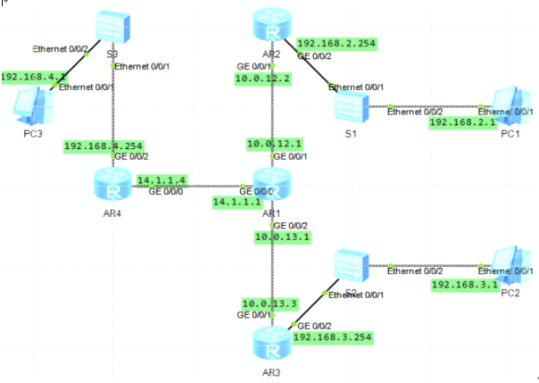

RIP路由协议

动态路由协议 小型网络适用  
配置地址  
\#  
r1  
interface GigabitEthernet0/0/0  
ip address 10.0.12.1 255.255.255.0  
interface LoopBack0  
ip address 10.0.1.1 255.255.255.0  
r2  
interface GigabitEthernet0/0/0  
ip address 10.0.12.2 255.255.255.0  
interface LoopBack0  
ip address 10.0.2.2 255.255.255.0  
\#  
  
r1  
rip 1  
network 10.0.0.0  
r2  
rip 1  
network 10.0.0.0  
查看路由表  
  
  
使用RIPv2搭建网络  
基于前面配置现在只需修改v2配置即可  
两台路由器上配置ripv2  
rip  
version 2  
查看路由表  
  
RIPv2的路由信息携带子网掩码  
RIPv2的路由信息中携带下一跳地址  
RIPv2默认采用组播方式发送报文，地址为224.0.0.9  
  
  
配置RIPv2认证  
常规配置RIPv2  
配置简单验证方式密码为huawei 明文的  
r1  
int g 0/0/1  
rip authentication-mode simple huawei  
r2  
int g 0/0/1  
rip authentication-mode simple huawei  
  
配置md5密文验证  
r1  
int g 0/0/1  
undo authentication-mode  
rip authentication-mode md5 usual huawei  
  
r2  
int g 0/0/1  
undo authentication-mode  
rip authentication-mode md5 usual huawei  
  
配置RIPv2自动汇总  
RIPv2自动汇总，默认是开启的，可以关闭  
rip 1  
version 2  
  
  
配置RIPv2手工汇总  
华为设备上，接口上默认弃用了水平分割功能，防止环路和不连续子网问题，默认的RIPv2自动汇总就会失效  
要使用RIPv2的默认自动汇总生效两种办法  
第一种，summary always，不论水平分割是否启用都生效  
[r3]rip  
[r3]version 2  
[r3]summary always  
第二种，关闭相应接口下的水平分割功能  
[r3]int g 0/0/0  
[r3]undo rip split-horizon  
查看路由表  
自动汇总成功  
RIPv2手工汇总，配合需要汇总的本地网络IP地址为3.3.0.0/22  
[r3]int g 0/0/0  
[r3]rip summary-address 3.3.0.0 255.255.255.0  
  
配置RIP版本定时器 让RIPv1和RIPv2版本兼容  
  
  
r1  
interface GigabitEthernet0/0/0  
ip address 10.0.12.1 255.255.255.0  
\#  
interface GigabitEthernet0/0/1  
ip address 192.168.10.1 255.255.255.0  
r2  
interface GigabitEthernet0/0/0  
ip address 10.0.12.2 255.255.255.0  
\#  
interface GigabitEthernet0/0/1  
ip address 192.168.20.1 255.255.255.0  
  
  
配置RIP协议版本兼容  
r1  
rip  
network 10.0.0.0  
network 192.168.10.0  
r2  
rip  
network 10.0.0.0  
network 192.168.20.0  
version 2  
查看路由表 发现不兼容 修改配置  
r1  
int g 0/0/0  
rip version 2 broadcast  
所以建议选择相同版本的RIP协议  
  
  
配置RIP定时器  
默认情况下RIP协议会每隔30S左右发送一次路由更新  
路由更新的有效期为超时定时器定义的180s，180s内未收到路由更新，则宣布路由不可达，从路由表中清楚掉该路由条目  
通过timers rip命令改变定时器的默认值来影响收敛速度  
将r1更新报文时间间隔修改为20s  
超时计时器超时时间修改为120s  
垃圾收集超时时间修改为60s  
rip 1  
timers rip 20 120 60

一个简单的RIP引入

配置RIPv2  
  
优化RIP  
因为PC不需要RIP通告 不需要接受无用的RIP更新报文  
采用引入直连路由，使用import-route direct引入，指定引入的源路由协议为直连路由

r2  
rip 1  
undo network 192.168.2.0  
import-route direct

查看路由表  
r3同样配置  
rip 1  
undo network 192.168.3.0  
import-route direct  
  
在公司B的网关设备上配置静态地址
192.168.4.0/24，并在RIP进程中引入该条静态路由，引入后公司B中RIP网络内会通过RIP协议自动学习  
[r1]ip route-static 192.168.4.0 24 14.1.1.4  
[r1]rip 1  
[r1-rip-1]import-route static  
查看其他路由表  
配置r4静态路由  
[r4]ip route-static 0.0.0.0 0.0.0.0 14.1.1.1  
测试
