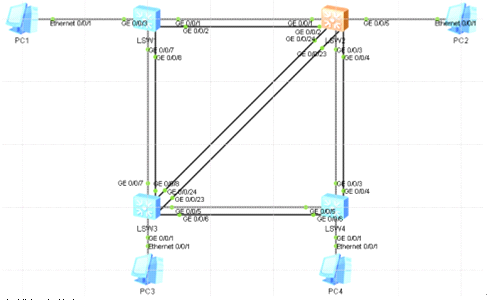
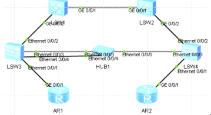

stp生成树协议

在以太网中，二层网络的环路会带来广播风暴，MAC地址表震荡，重复数据帧等问题  
了解 STP、RSTP 与 MSTP。  
掌握修改网桥优先级影响根网桥选举的方法  
掌握影响根端口和指定端口选举的方法  
掌握配置 RSTP 的方法以及 STP 不 RSTP 的相兼容问题  
掌握配置 MSTP 实现不同 VLAN 负载均衡的方法  
  
STP的主要作用：  
1. 消除环路：通过阻断冗余链路来消除网络中可能存在的环路。  
2. 链路备份：当活动路径发生故障时，激活备份链路，及时恢复网络连通性。

为了避免网络中的环路问题，需要在网络中的交换机上配置STP。本实验中，您还需要通过修改桥优先级来控制STP的根桥选举，并通过配置STP的一些特性来加快STP的收敛速度。  
s1 s2 s3 s4开启stp  
stp enable  
stp mode stp \#修改模式MSTP\|RSTP\|STP 华为默认mstp  

  
查找根交换机  
[sw1]dis stp  
-------[CIST Global Info][Mode MSTP]-------  
CIST Bridge :32768.4c1f-ccf2-3bdb \#自己的桥  
Config Times :Hello 2s MaxAge 20s FwDly 15s MaxHop 20  
Active Times :Hello 2s MaxAge 20s FwDly 15s MaxHop 20 时间值  
CIST Root/ERPC :32768.4c1f-cc96-2d07 / 20000 \#根桥/去往根的开销,优先级  
CIST RegRoot/IRPC :32768.4c1f-ccf2-3bdb / 0  
查看接口状态  
dis stp brief  
  
根交换的选举  
确定s1配置为主根交换机 s2为备根交换机  
[sw1]stp priority 4096  
[sw2]stp priority 8192  
在查看sw1,sw2  
[sw2]dis stp  
-------[CIST Global Info][Mode MSTP]-------  
CIST Bridge :8192 .4c1f-cc96-2d07 \#自己的开销值  
Config Times :Hello 2s MaxAge 20s FwDly 15s MaxHop 20  
Active Times :Hello 2s MaxAge 20s FwDly 15s MaxHop 20  
CIST Root/ERPC :4096 .4c1f-ccf2-3bdb / 20000 \#根开销值  
CIST RegRoot/IRPC :8192 .4c1f-cc96-2d07 / 0  
  
也可以用另外一种办法配置优先级，使用stp root
primary\|secondary命令配置主备根交换机，需要删除之前定义的，  
[sw1]stp root primary  
[sw2]stp root secondary  
目的是自动把s1优先级改为0，s2优先级改为4096  
  
根端口的选举  
根端口的选举，上面说了可以对根交换机进行选举，现在继续对根端口进行选举，生成树在选举出根交换机后，会在每台非根交换机选举根端口，选举时首先比较该交换机上每个端口到达根交换机的跟路径开销，路径开销最小端口将成为根端口。根据根路径开销值相同，则比较每个端口所在链路上的上行交换机ID，如果该交换机ID也相同，则比较每个端口所在链路上的上行端口ID，每台交换机上只能拥有一个根端口。  
查看非根交换s4的根端口的开销值  
[sw4]dis stp int e 0/0/2  
Port Cost(Dot1T ) :Config=auto / Active=20000  
可以看到，接口路径开销采用的事Dot1T的计算方法，Config是指手工配置的路径开销，Active是实际使用的路径开销，开销值为20000  
配置s4的E0/0/2接口的代价值为20001，则修改接口的默认代价值  
[sw4]int e 0/0/2  
[sw4-Ethernet0/0/2]stp cost 20001  
[sw4]dis stp br  
可以看到此时e0/0/1端口变成根端口，e0/0/2变成alternate端口，因为根路径开销大于e0/0/1的跟路径开销，  
生成树协议在每台非根交换机选举出根端口之后，将在每个网段上选举指定端口，选举的比较规则和选举根端口类似，  
选举指定端口，首先比较根路径开销  
  
  
stp定时器  
默认情况下需要等待30秒生成树重新计算时间  
普通生成树不能实现快速收敛，在stp中有hello time定时器、max age定时器、forward
delay定时器、未收到上游的bpdu就重新开始生成树计算的超时时间等参数影响其收敛速度，通过配置合适的系统参数，可以使用stp实现快速拓扑收敛。  
dis stp \# 查看  
可以看到默认，bpdu每2秒发送一次hello，最大的老化时间为20秒，转发延迟为15秒，最大传递跳数为20跳。config
times表示是当前设备配置的计时器，而actie
times表示是正在生效的计时器，一般两个相同  
  
不建议直接修改定时器时间,会产生大量丢包情况，所有使用  
stp
bridge-diameter命令设置网络直径,交换机会根据网络直径自动计算出3个时间参数的最优值  
需要在根交换机上配置才生效  
[s1]stp bridge-diameter 3 \#设置网络直径为3  
dis stp观察

rstp协议  
STP能解决环路问题,但也存在一些不足没有没有细致区分端口状态和端口角色,其次STP端口状态有5种,收敛较慢  
RSTP坐出改进,新增2中端口角色,共有4种根端口、指定根端口、Alternate端口和Backup端口  
公司的网络使用了两层网络结构，核心层和接入层，并采用了冗余设计。需要通过使用RSTP来避免网络中产生二层环路问题。本实验中，还将通过配置RSTP的一些特性来加快RSTP收敛速度，并配置相关保护功能。  
试验环境  

  
r1 r2当作PC为10.1.1.2/24 10.1.1.3/24  
sw1 sw2 sw3 sw4上切换rstp模式  
stp mode rstp  
dis stp \# 观察主根交换  
修改sw1为主根 sw2为备根  
[sw1]stp root primary \#修改为最小  
[sw2]stp root secondary \#修改为次小  
shutdown掉端口查看stp状态  
优化配置边缘端口 接PC路由防火墙等不需要STP的端口配置为边缘端口 加快收敛速度  
因为默认收敛时间为15+15=30秒  
通过在该端口上配置命令便可解决此问题。在网络边缘设备上配置该命令，使边缘端口不处理、不发送BPDU报文，该端口即为BPDU
filter端口。  
配置无需等待  
int e 0/0/1  
stp edged-port enable  
stp bpdu-filter enable  
shutdown接口测试马上无延迟可提高网络可用性  
  
  
mstp协议(华为默认mstp)  
http://support.huawei.com/enterprise/zh/doc/EDOC1000069579?section=j038  
RSTP和STP还存在同一个缺陷，由于局域网内所有vlan共享一颗生成树，链路备堵塞后将不承载任何流量，造成带宽浪费，因此无法在vlan间实现数据流量的负载均衡，还有可能造成vlan的报文无法转发。  
通过mstp吧一个交换网络划分成多个域，每个域内形成多棵生成树，生成树之间彼此独立，每个域叫做MST域，每棵生成树叫做一个多生成树实例MSTI  
实例内可以包含多个vlan，通过将多个vlan，映射到同一实例内，可以节省通信开销和资源占用率。MSTP各个实例拓扑的生成树计算相互独立，通过这些实例可以实现负载均衡，把多个相同拓扑结构的vlan映射到一个实例里，这些vlan在端口上的转发状态取决于端口在对应MSTP实例的状态。  
MSTP通过设置VLAN映射表，把vlan和MSTI联系起来，每个vlan职能对应一个MSTI，既同一个vlan的数据智能在一个MSTI中传输，而一个MSTI可能对应对个VLAN  
  
mstp实现负载均衡  
环境  
PC1 10.1.10.1/24  
PC2 10.1.10.2/24  
PC3 10.1.20.1/24  
PC4 10.1.20.2/24  
基础配置 实现创建vlan10 20 让他们vlan间互通  
  
设置sw1为主根交换机  
[sw1]stp root primary  
然后查看各交换机根端口情况  
  
可以发现，s1端口都为指定端口，s3上的e0/0/2为替代端口，处于丢弃状态，MSTID，既SMTP的实例ID，三台交换机上目前都为0，即在默认情况下，所有vlan都处于mstp实例0中  
可以发现s3的E0/0/2接口上，没有任何数据包转发，只接收到上行接口周期发送BPDU  
抓包测试链路状态 一条链路处于闲置 一条链路处于忙碌  
下面配置MSTP多实例实现链路负载  
配置mstp  
MSTP使用多个MST域组成,每个MST域包含一个和多个MST实例,默认都在MSTI0中,MSTI之间彼此独立  
在S1上配置MSTP的多实例  
stp region-configuration \# 进入MST域视图  
region-name huawei1 \#
mstp名，同一个域内的交换机域名必须相同（多个mstp域相连，每个域被看做一台sw）  
revision-level 1 \# 修订级别为1  
instance 1 vlan 10 \# 创建实例1，并将vlan10放入实例1中 可指定多个vlan  
instance 2 vlan 20 \# 创建实例2，并将vlan20放入实例2中  
active region-configuration \# 激活以上配置，否则配置不生效也看不到  
  
dis stp region-configuration \# 查看  
dis stp instance 0 brief \#
因为默认区域都在0下，确定生成树状态，三台都查看，确定主根交换  
dis stp instance 1 brief \# 查看创建区域1生成树状态  
dis stp instance 2 brief \# 查看创建区域2生成树状态  
发现区域1中 sw2为根交换，区域2中也是sw2为根交换  
  
现在继续抓包测试 还是老样子  
要实现链路都被利用 负载 配置区域的主根交换机位置  
修改两台交换为  
实例 1 的根为 SW1，备份根为 SW2，  
实例 2 的根为 SW2，备份根为 SW1。  
\# [sw1]  
stp instance 1 priority 4096  
stp instance 2 priority 8192  
\# [sw2]  
stp instance 1 priority 8192  
stp instance 2 priority 4096  
或者也可以这样  
[sw1]  
stp instance 1 root primary  
stp instance 2 root secondary  
[sw2]  
stp instance 2 root primary  
stp instance 1 root secondary  
  
[sw3]dis stp brief  
表示在SW3上的实例 1 里，根端口为 g0/0/1,  
而在实例 2 里，根端口为 g0/0/2  
在SW3上查看并抓包测试  
从而实现了负载均衡。
