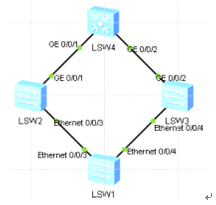

主备链路冗余备份和故障快速迁移

Smart Link:能保证本设备上行链路发生故障后快速进行倒换,对于跨设备不能提供保护  
Monitor Link:能扩展smart
link的链路备份范围,通过监控上游设备的上行链路,达到上行链路故障迅速传达给下游设备,触发主备切换,  
  
交换机s4作为公司出口设备连接外网，交换机s1是接入层交换，s2
s3核心交换，为实现主备链路冗余备份及故障后的快速迁移，采用smart
link技术，且使用monitor link联动方式监控上游设备  
环境

配置smart link  
在s1上配置  
创建smart link组1,并开启smart link组功能  
smart-link group 1  
smart-link enable  
配置smart link需要关闭生成树协议 默认开启 若不关闭将提示报错  
interface Ethernet0/0/3  
stp disable  
interface Ethernet0/0/4  
stp disable  
进入smart link组1  
smart-link group 1  
port Ethernet 0/0/3 master  
port Ethernet 0/0/4 slave  
查看  
display smart-link group 1  
  
  
模拟测试 关闭sw2上端口  
display smart-link group 1  
Ethernet0/0/3 Master Inactive  
Ethernet0/0/4 Slave Active  
在打开s2端口  
主备切换状态
得出结论当主链路发生故障时,备份接口启用,但为了维持稳定性,不会抢占会原来状态  
可通过配置自动回切功能 实现自动抢占,默认不会自动回切 需要手动 在s1上配置  
[s1]smart-link group 1  
[s1-smlk-group1]restore enable \# 开启回切  
[s1-smlk-group1]timer wtr 30 \# 默认时间为60秒改为30  
重复上述测试  
30秒后会提示 则抢占成功  
Dec 16 2018 20:57:31-08:00 sw1 %%01SMLK/4/SMLK_STATUS_LOG(l)[11]:The state of Sm  
art link group 1 changed to MASTER.  
  
  
Monitor link模式通过监控上游设备的上行链路 对下行链路进行同步设置
从而触发下游设备的smart link的主备链路切换  
如关闭sw2的上行链路g0/0/1 sw1无法感知，导致网络中断，配置解决  
在s2主链路上层设备上配置  
[s2]monitor-link group 1  
[s2-mtlk-group1]port GigabitEthernet0/0/1 uplink  
[s2-mtlk-group1]port Ethernet0/0/3 downlink  
然后查看sw1状态 已经响应 关闭\|打开 测试  
display smart-link group 1  
修改monitor link回切时间为10秒（默认3秒）  
[s2-mtlk-group1]timer recover-time 10

完成测试
