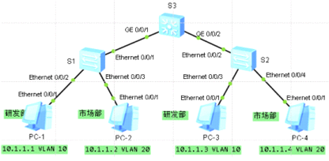

trunk接口

一般用于交换与交换之间连接的端口,trunk接口可以属于多个vlan,可以接受和发送多个vlan报文  
当trunk接口收到数据帧时,如果该帧不包含802.1Q的vlan标签,则打上该trunk端口的PVID,如果该帧包含802.1Q标签,则不变,  
当trunk端口发送数据帧时,当该所发送帧的vlanID与端口的PVID不同时,检查是否允许通过,若允许直接通过,不允许丢弃,当该帧vlanID与端口的PVID相同时,则剥离vlan标签后转发

  
  
  
\<S1\>display current-configuration  
vlan batch 10 20  
\#  
interface Ethernet0/0/1  
port link-type trunk  
port trunk allow-pass vlan 10 20  
\#  
interface Ethernet0/0/2  
port link-type access  
port default vlan 10  
\#  
interface Ethernet0/0/3  
port link-type access  
port default vlan 20

\<S2\>display current-configuration  
vlan batch 10 20  
interface Ethernet0/0/2  
port link-type trunk  
port trunk allow-pass vlan 10 20  
\#  
interface Ethernet0/0/3  
port link-type access  
port default vlan 10  
\#  
interface Ethernet0/0/4  
port link-type access  
port default vlan 20

\<S3\>display current-configuration  
vlan batch 10 20  
interface GigabitEthernet0/0/1  
port link-type trunk  
port trunk allow-pass vlan 2 to 4094  
\#  
interface GigabitEthernet0/0/2  
port link-type trunk  
port trunk allow-pass vlan 2 to 4094
