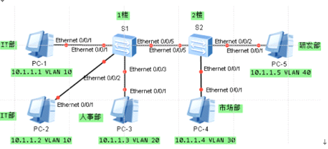

VLAN基础和access接口

access接口是交换机上用来连接用户主机的接口,当access接口从主机收到一个不带vlan标签的数据帧,便会给改数据帧加上与PVID一致的vlan标签(PVID默认为1,可修改),所有交换默认都属于vlan1,当access接口要发送数据时,检查该数据属于vlanID是否与自己PVID相同,不同则丢弃,  
  
交换机接口收到一个广播帧；接口属于同vlan内的其他接口及trunk干道接口进行泛洪  
  
access收到：不带任何tag 打上access接口所属pvid标签  
access发出：带有本pvid标签的数据帧，删除标签还原为纯以太网帧发出  
  
trunk发出：带有pvid=1  
和pvid值一致；删除tag还原为纯以太网帧发送  
不和pvid值一致；保留原有标签进行发送  
  
trunk接收：  
不携带任何标签（纯以太网帧）：打上trunk接口属于pvid值得标签，已经携带了标签的数据帧；保留原有原有标签  
  
  
  

  
  
  
\<S1\>display current-configuration  
vlan batch 10 20  
\#  
interface Ethernet0/0/1  
port link-type access  
port default vlan 10  
\#  
interface Ethernet0/0/2  
port link-type access  
port default vlan 10  
\#  
interface Ethernet0/0/3  
port link-type access  
port default vlan 20

\<S2\>display current-configuration  
vlan batch 30 40  
\#  
interface Ethernet0/0/1  
port link-type access  
port default vlan 30  
\#  
interface Ethernet0/0/2  
port link-type access  
port default vlan 40
