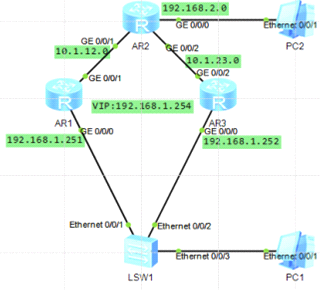
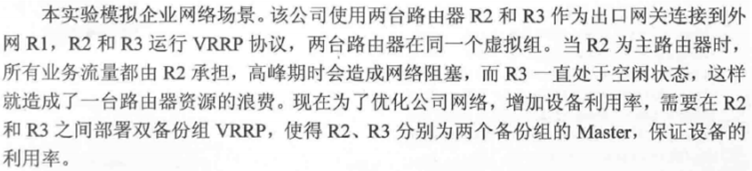

VRRP基本配置

配置VRRP多备份组  
配置VRRP的跟踪接口及认证

http://www.023wg.com/kkxpz/84.html \# 高级用法  
VRRP是虚拟路由器冗余协议,它把几台路由设备联合组成一台虚拟路由设备,该虚拟路由设备拥有一个虚拟ID和虚拟IP地址.该虚拟路由器是由一个MASTER设备和若干BACKUP设备组成,业务全部有MASTER承担,当MASTER出现故障,BACKUP接替,  
VRRP的MASTER选举基于优先级,取值范围0\~255,默认情况下优先级为100,可修改

VRRP基本配置  

  
部署OSPF网络进行宣告  
在出口网管路由器r1 r2 r3上配置ospf协议进程号为1,区域为0  
ospf 1  
area 0  
network x.x.x.0 0.0.0.255 \#根据情况配置  
network x.x.x.0 0.0.0.255  
配置VRRP协议  
为了提高网络的可靠性,采用双出口的方式连接到外网,准备出口网管路由器实现主备备份,当主故障自动切换到备  
在R2和R3上配置VRRP协议,使用  
vrrp vrid 1 virtual-ip  
创建VRRP备份组,指定即R1合R2处于同一个VRRP备份组内,VRRP备份组号为1,  
配置虚拟IP为192.168.1.254 并且配置优先级为120 默认为100 使其成为主
其他默认成为备  
r1  
interface GigabitEthernet0/0/0  
ip address 192.168.1.251 255.255.255.0  
vrrp vrid 1 virtual-ip 192.168.1.254  
vrrp vrid 1 priority 120  
r3  
interface GigabitEthernet0/0/0  
ip address 192.168.1.252 255.255.255.0  
vrrp vrid 1 virtual-ip 192.168.1.254  
  
dis vrrp \#查看状态  
dis vrrp brief  
测试  
  
  
配置VRRP多备份组  
当VRRP配置为但备份组时，业务全部由master设备承担，而backup设备完全处于空闲状态，VRRP可以通过配置多备份组来实现负载分担，  
vrrp允许同一台设备的同一个接口加入多搞VRRP备份组，在不同备份组中有不同优先级，也就是建立多个虚拟网关路由器。各主机可以使用不同的虚拟组路由器作为网关出口，这样可以达到分担数据流而又相互备份的目的。  
VRRP的优先级取值范围,255是保留给IP地址拥有者使用的,当一个VRRP路由器的物理端口IP地址和虚拟路由器的虚拟IP地址相同,这台路由器成为虚拟IP地址拥有者,VRRP优先级自动设置为255,优先级0也是特殊值,当MMASTER设备删除VRRP配置停止运行VRRP时,会发送优先级为0的VRRP报文通知BACKUP设备,当BACKUP收到消息,立刻从BACKUP状态转为MASTER状态  

  
基础配置如上  
配置VRRP双备份组  
在r2 r3上创建VRRP虚拟组1，虚拟为172.16.1.254，r2优先级为120  
再在r2 r3上创建VRRP虚拟组2，虚拟IP为172.16.1.253 指定R3优先级为120  
r2  
interface GigabitEthernet0/0/2  
ip address 192.168.1.100 255.255.255.0  
vrrp vrid 1 virtual-ip 192.168.1.254  
vrrp vrid 1 priority 120  
vrrp vrid 2 virtual-ip 192.168.1.253  
r3  
interface GigabitEthernet0/0/2  
ip address 192.168.1.200 255.255.255.0  
vrrp vrid 1 virtual-ip 192.168.1.254  
vrrp vrid 2 virtual-ip 192.168.1.253  
vrrp vrid 2 priority 120  
  
------------------------------  
验证vrrp抢占特性  
在虚拟组2中r3为master路由，优先级为120，现在虚拟组2中修改r2的抢占模式为非抢占方式（默认是抢占方式），并将优先级改为200，大于r3的优先级  
r2  
int e 1/0/1  
vrrp vrid 2 preempt-mode disable  
vrrp vrid 2 priority 200  
查看dis vrrp  
即使由于r2非抢占模式，r2不会抢占成为master

配置虚拟IP拥有者  
在虚拟组1中，r2配置的优先级为120，r3的配置优先级为I默认的100，r2暂时是虚拟组1的master路由器，现在网络管理员为保证r2在虚拟组1始终是master，在r2的e1/0/1接口上修改IP地址为172.16.1.254/24，这样r2就成为了该虚拟组的虚拟IP地址拥有者  
r2  
int e 1/0/1  
ip addr 172.16.1.254 24  
更改r3在虚拟组1的配置优先级为可配的最大值254，这样r3的配置优先级就大于现在的r2的配置优先级  
r3  
int e 1/0/1  
vrrp vrid 1 priority 254  
dis vrrp查看  
在r2虚拟组1的配置优先级为120，但是在成为虚拟IP地址拥有者之后，其运行优先级为255，高于优先级254，所以无法抢占成为改组的master  
  
  
配置VRRP的跟踪接口及认证  
当VRRP的MASTER设备的上行接口出现问题,而MASTER设备一直保持active状态,那么就会导致网络出现中断,所有必须要使得VRRP的运行状态和上行接口能够关联,再配置了VRRP冗余的网络中,为进一步提高网络可靠性,需要在MASTER设备上配置上行接口监视,监视连接了外网的出接口,当此接口断掉时,自动减小优先级一定数值,该数值为人为配置,减小后的优先级小于BACKUP设备优先级,这样BACKUP设备就会抢占MASTER角色接替工作  
r1  
interface GigabitEthernet0/0/0  
ip address 192.168.1.251 255.255.255.0  
vrrp vrid 1 virtual-ip 192.168.1.254  
vrrp vrid 1 priority 120  
vrrp vrid 1 track interface GigabitEthernet0/0/1 reduced 50  
r3  
interface GigabitEthernet0/0/0  
ip address 192.168.1.252 255.255.255.0  
vrrp vrid 1 virtual-ip 192.168.1.254  
vrrp vrid 1 track interface GigabitEthernet0/0/2 reduced 51  
  
r1上查看dis vrrp  
GigabitEthernet0/0/0 \| Virtual Router 1  
State : Backup  
Virtual IP : 192.168.1.254  
Master IP : 192.168.1.252  
PriorityRun : 70 \# 可见减小了50 低于r3,默认情况下是减小10

在r1和r3上配置认证,增加安全性  
在r1和r3上对vrrp虚拟组1配置接口认证模式,认证方式为md5,密码为huawei  
r1  
interface GigabitEthernet0/0/0  
ip address 192.168.1.251 255.255.255.0  
vrrp vrid 1 virtual-ip 192.168.1.254  
vrrp vrid 1 priority 120  
vrrp vrid 1 track interface GigabitEthernet0/0/1 reduced 50  
vrrp vrid 1 authentication-mode md5 huawei  
r3  
interface GigabitEthernet0/0/0  
ip address 192.168.1.252 255.255.255.0  
vrrp vrid 1 virtual-ip 192.168.1.254  
vrrp vrid 1 track interface GigabitEthernet0/0/2 reduced 51  
vrrp vrid 1 authentication-mode md5 huawei
