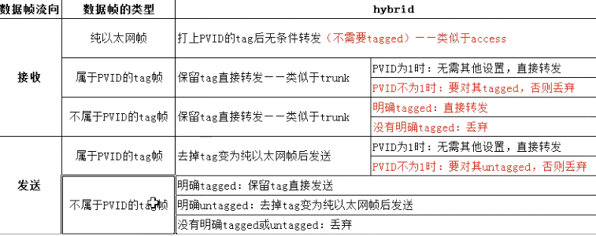
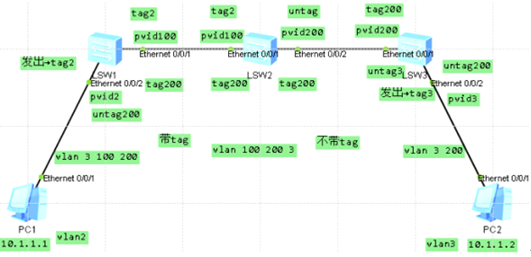

hybrid数据流向

一个hybrid实例，搞定数据流向

数据流向 PC1→PC2，注意vlan信息的创建  
pc1发出数据帧  
sw1 e0/0/1接收并携带tag2发出  
sw1 e0/0/2接收到tag2数据帧，需要port hybrid tagged vlan 2发出  
sw2 e0/0/1接收到tag2数据帧，需要port hybrid tagged vlan 2发出  
sw2 e0/0/2接收到tag2数据帧，需要port hybrid untagged vlan 2发出  
sw3 e0/0/1接收到无tag数据帧，携带tag200发出  
sw3 e0/0/2接收到tag200数据帧，需要port hybrid untagged vlan 200发出  
到pc2  
数据流向 PC2→PC1  
pc2回包  
sw3 e0/0/2接收并携带tag3发出  
sw3 e0/0/1接收到tag3数据帧，需要port hybrid untagged vlan 3发出  
sw2 e0/0/2接收到无tag数据帧，携带tag200发出  
sw2 e0/0/1接收到tag200数据帧，port hybrid tagged vlan 200发出  
sw1 e0/0/1接收到tag200数据帧，port hybrid tagged vlan 200发出  
sw1 e0/0/2接收到tag200数据帧，port hybrid untagged vlan 200发出  
pc1响应  
数据流向完成
