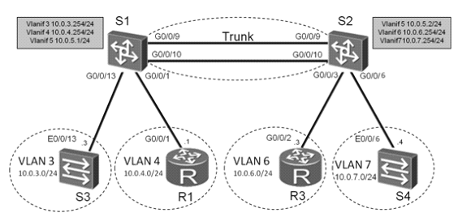

实验 1-5 配置三层交换

学习目标  
· 掌握通过三层交换机实现VLAN间通信的配置方法  
· 掌握通过以太网Trunk链路实现VLAN间通信的配置方法  
· 掌握在不同VLAN间配置动态路由协议OSPF的方法

场景  
在企业网络中，通过使用三层交换机可以简便的实现VLAN间通信。作为企业的网络管理员，您需要在三层交换机配置VLANIF接口的三层功能，使得如上所示拓扑图中的网络能够实现VLAN间通信。此外，为了使S1和S2所连接的不同网络能够进行三层通信，还需要配置路由协议。  
配置文档

[R1]display current-configuration  
[V200R007C00SPC600]  
\#  
sysname R1  
\#  
interface GigabitEthernet0/0/1  
ip address 10.0.4.1 255.255.255.0  
\#  
ip route-static 0.0.0.0 0.0.0.0 10.0.4.254  
\#  
return

[S1]display current-configuration  
!Software Version V200R008C00SPC500  
\#  
sysname S1  
\#  
vlan batch 3 to 7  
\#  
interface Vlanif3  
ip address 10.0.3.254 255.255.255.0  
\#  
interface Vlanif4  
ip address 10.0.4.254 255.255.255.0  
\#  
interface Vlanif5  
ip address 10.0.5.1 255.255.255.0  
\#  
interface Eth-Trunk1  
port link-type trunk  
port trunk pvid vlan 5  
port trunk allow-pass vlan 2 to 4094  
mode lacp  
\#  
interface GigabitEthernet0/0/1  
port link-type access  
port default vlan 4  
\#  
interface GigabitEthernet0/0/9  
eth-trunk 1  
\#  
interface GigabitEthernet0/0/10  
eth-trunk 1  
\#  
interface GigabitEthernet0/0/13  
port link-type access  
port default vlan 3  
\#  
ospf 1  
area 0.0.0.0  
network 10.0.0.0 0.255.255.255  
\#  
return

[S2]display current-configuration  
!Software Version V200R008C00SPC500  
\#  
sysname S2  
\#  
vlan batch 3 to 7  
\#  
interface Vlanif5  
ip address 10.0.5.2 255.255.255.0  
\#  
interface Vlanif6  
ip address 10.0.6.254 255.255.255.0  
\#  
interface Vlanif7  
ip address 10.0.7.254 255.255.255.0  
\#  
interface Eth-Trunk1  
port link-type trunk  
port trunk pvid vlan 5  
port trunk allow-pass vlan 2 to 4094  
mode lacp  
\#  
interface GigabitEthernet0/0/3  
port link-type access  
port default vlan 6  
\#  
interface GigabitEthernet0/0/6  
port link-type access  
port default vlan 7  
\#  
interface GigabitEthernet0/0/9  
eth-trunk 1  
\#  
interface GigabitEthernet0/0/10  
eth-trunk 1  
\#  
ospf 1  
area 0.0.0.0  
network 10.0.0.0 0.255.255.255  
\#  
return

[S3]display current-configuration  
\#  
!Software Version V100R006C05  
sysname S3  
\#  
interface Vlanif1  
ip address 10.0.3.3 255.255.255.0  
\#  
interface Ethernet0/0/7  
shutdown  
\#  
ip route-static 0.0.0.0 0.0.0.0 10.0.3.254  
\#  
return

[S4]display current-configuration  
\#  
!Software Version V100R006C05  
sysname S4  
\#  
interface Vlanif1  
ip address 10.0.7.4 255.255.255.0  
\#  
interface Ethernet0/0/14  
shutdown  
\#  
ip route-static 0.0.0.0 0.0.0.0 10.0.7.254  
\#  
return
