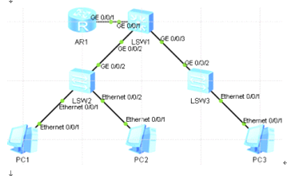

单臂路由

因为只有一个接口,路由配置逻辑子接口当作vlan网关  
int g 0/0/1.1  
ip addr 10.1.1.254 24  
int g 0/0/1.2  
ip addr 10.1.2.254 24  
int g 0/0/1.3  
ip addr 10.1.3.254 24  
  
核心交换配置trunk口  
int g 0/0/1  
port link-type trunk  
port trunk allow-pass vlan 10 20 30  
int g 0/0/2  
port link-type trunk  
port trunk allow-pass vlan 10 20 30  
int g 0/0/3  
port link-type trunk  
port trunk allow-pass vlan 10 20 30  
  
  
接入交换配置access口和trunk口  
sw2  
int e 0/0/1  
port link-type access  
port default vlan 10  
int e 0/0/2  
port link-type access  
port default vlan 20  
int g 0/0/2  
port link-type trunk  
port trunk allow-pass vlan 10 20 30  
sw3  
int e 0/0/1  
port link-type access  
port default vlan 30  
int g 0/0/2  
port link-type trunk  
port trunk allow-pass vlan 10 20 30  
  
  
基础配置完成,但是无法通讯,因为路由器三层设备无法处理带vlan标签的数据数据包,交换机可以处理,所以下面配置路由器子接口封装VLAN,让他能够识别vlan标签,包括剥离和封装vlan  
配置路由器  
在子接口封装对应的vlan  
int G 0/0/1.1  
dot1q termination vid 10 \# 对子接口加入一层vlan 10的tag报文  
arp broadcast enable \# 开启子接口ARP广播功能,若不加无法主动发送arp广播  
其他子接口同样配置
