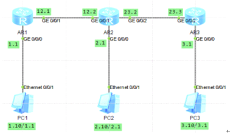

默认路由和静态路由

sysname r1  
int g 0/0/1  
ip addr 10.1.12.1 24  
int g 0/0/0  
ip addr 192.168.1.1 24  
q  
ip route-static 192.168.2.0 24 10.1.12.2  
ip route-static 192.168.3.0 24 10.1.12.2  
ip route-static 10.1.23.0 24 10.1.12.2  
sysname r2  
int g 0/0/1  
ip addr 10.1.12.2 24  
int g 0/0/2  
ip addr 10.1.23.2 24  
int g 0/0/0  
ip addr 192.168.2.1 24  
q  
ip route-static 192.168.1.0 24 10.1.12.1  
ip route-static 192.168.3.0 24 10.1.23.3  
sysname r3  
int g 0/0/2  
ip addr 10.1.23.3 24  
int g 0/0/0  
ip addr 192.168.3.1 24  
q  
ip route-static 192.168.1.0 24 10.1.23.2  
ip route-static 192.168.2.0 24 10.1.23.2  
ip route-static 10.1.12.0 24 10.1.23.2

浮动静态路由及负载均衡  
实现全网通讯  
\#  
r1  
ip route-static 192.168.20.0 24 10.0.13.3  
r2  
ip route-static 192.168.20.0 24 10.0.23.3  
ip route-static 192.168.10.0 24 10.0.12.1  
r3  
ip route-static 192.168.10.0 24 10.0.13.1  
\#  
  
前面实现总部可访问分部  
现在配置浮动静态路由实现路由备份，当两分部间通讯时，直连链路为主用链路，通过总部的链路为备用链路，  
即当主用链路发生故障时，可以使用备用链路保障两部分网络间通信。这里使用浮动静态路由实现网络冗余。  
在r1上配置静态路由 路由优先级为100默认60 优先小的  
[r1]ip route-static 192.168.20.0 24 10.0.12.2 preference 100  
[r1]dis ip routing-table 查询无变化  
[r1]display ip routing-table protocol static 用这个查询可发现两条路由条目  
r3上配置同样静态路由 路由优先级为100默认60 优先小的  
[r3]ip route-static 192.168.10.0 24 10.0.23.2 preference 100  
[r1]display ip routing-table protocol static  
  
shutdown和undo shutdown  
r1和r2其中一个接口 观察 路由表条目

通过负载均衡实现网络优化  
在两台从路由器上配置  
\#  
r1  
ip route-static 192.168.20.0 255.255.255.0 10.0.13.3  
ip route-static 192.168.20.0 255.255.255.0 10.0.12.2  
r3  
ip route-static 192.168.10.0 255.255.255.0 10.0.13.1  
ip route-static 192.168.10.0 255.255.255.0 10.0.23.2  
\#  
  
tracert 测试路由走向  
从而实现负载均衡
