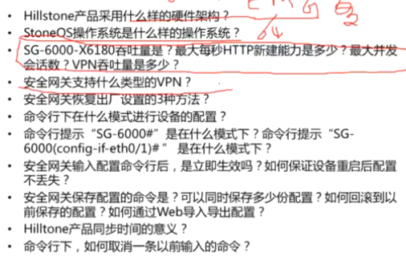

1. 进入接口模式、绑定接口到安全域  
配置接口IP地址  
SG-6000(config)\# interface eth0/4  
SG-6000(config-if-eth0/4)\# zone untrust  
SG-6000(config-if-eth0/4)\# ip address 200.0.0.10/24  
SG-6000(config-if-eth0/4)\# interface eth0/1  
SG-6000(config-if-eth0/1)\# zone trust  
SG-6000(config-if-eth0/1)\# ip address 192.168.10.1/24  
SG-6000(config-if-eth0/1)\# manage http  
SG-6000(config-if-eth0/1)\# interface eth0/2  
SG-6000(config-if-eth0/2)\# ip address 192.168.110.1/24  
SG-6000(config-if-eth0/2)\# manage http  
SG-6000(config-if-eth0/2)\# exit  
  
2. 默认路由和SNAT  
SG-6000(config)\# ip vrouter trust-vr  
SG-6000(config-vrouter)\# ip route 0.0.0.0/0 200.0.0.1  
SG-6000(config-vrouter)\# snatrule from any to any service any eif e0/4 trans-to
eif-ip mode dynamicport  
SG-6000(config-vrouter)\#exit  
  
3. 添加策略  
SG-6000(config)\# policy-global  
SG-6000(config-policy)\# rule  
SG-6000 (config-policy-rule)\# action permit  
SG-6000 (config-policy-rule)\# src-zone trust  
SG-6000 (config-policy-rule)\# dst-zone untrust  
SG-6000 (config-policy-rule)\# src-addr any  
SG-6000 (config-policy-rule)\# dst-addr any  
SG-6000 (config-policy-rule)\# service any  
SG-6000(config-policy)\#exit  
  
show interface\\zone\\ip route\\policy\\config\\?  
  

