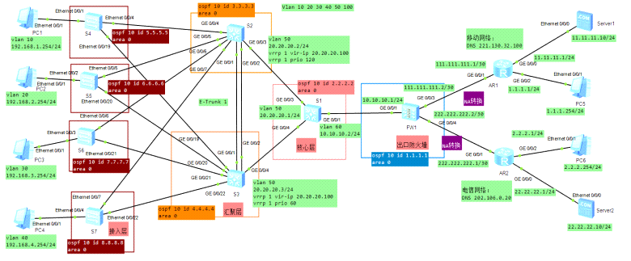

配置交换机Eth-Trunk+VRRP+MSTP+接口BFD状态联动+Telnet示例

组网需求：  
1、实现网络主备切换，互相冗余，负载分担，Vlan 10、20走S2交换机，Vlan 30
40走S3交换机；  
2、实现Vlan 10、20走移动网络，Vlan 30 40走电信网络；  
3、实现全网telnet连接。

  
FW1

\#  
acl number 3001  
rule 1 permit ip source 192.168.1.0 0.0.0.255  
rule 2 permit ip source 192.168.2.0 0.0.0.255  
\#  
acl number 3002  
rule 1 permit ip source 192.168.3.0 0.0.0.255  
rule 2 permit ip source 192.168.4.0 0.0.0.255  
\#  
interface GigabitEthernet0/0/0  
ip address 192.168.0.1 255.255.255.0  
dhcp select interface  
dhcp server gateway-list 192.168.0.1  
\#  
interface GigabitEthernet0/0/1  
ip address 10.10.10.1 255.255.255.0  
\#  
interface GigabitEthernet0/0/3  
ip address 111.111.111.2 255.255.255.252  
\#  
interface GigabitEthernet0/0/4  
ip address 222.222.222.2 255.255.255.252  
  
\#  
interface LoopBack1  
description guanli-to-S1  
alias LoopBack1  
ip address 9.9.9.1 255.255.255.0  
\#  
firewall zone trust  
set priority 85  
add interface GigabitEthernet0/0/0  
add interface GigabitEthernet0/0/1  
\#  
firewall zone untrust  
set priority 5  
add interface GigabitEthernet0/0/3  
add interface GigabitEthernet0/0/4  
\#  
aaa  
local-user admin password cipher admin  
local-user admin service-type telnet  
local-user admin level 3  
\#  
ospf 10 router-id 1.1.1.1  
import-route static  
area 0.0.0.0  
network 111.111.111.0 0.0.0.255  
network 222.222.222.0 0.0.0.255  
network 10.10.10.0 0.0.0.255  
network 9.9.9.0 0.0.0.255  
\#  
ip route-static 0.0.0.0 0.0.0.0 111.111.111.1  
ip route-static 0.0.0.0 0.0.0.0 222.222.222.1  
ip route-static 1.1.1.0 255.255.255.0 111.111.111.1  
ip route-static 2.2.2.0 255.255.255.0 222.222.222.1  
ip route-static 11.11.11.0 255.255.255.0 111.111.111.1  
ip route-static 22.22.22.0 255.255.255.0 222.222.222.1  
\#  
user-interface vty 0 4  
authentication-mode aaa  
user privilege level 15  
\#  
policy-based-route 1 permit node 1  
if-match acl 3001  
apply ip-address next-hop 111.111.111.1  
policy-based-route 2 permit node 2  
if-match acl 3002  
apply ip-address next-hop 222.222.222.1  
\#  
sysname FW1  
\#  
firewall packet-filter default permit all

S1

\#  
sysname S1  
\#  
vlan batch 50 60 100  
\#  
vlan 100  
description guanli  
\#  
aaa  
local-user admin password cipher admin  
local-user admin privilege level 3  
local-user admin service-type telnet  
\#  
interface Vlanif50  
ip address 20.20.20.1 255.255.255.0  
\#  
interface Vlanif60  
ip address 10.10.10.2 255.255.255.0  
\#  
interface Vlanif100  
description guanli-to-S2/S3  
ip address 100.100.100.1 255.255.255.0  
\#  
interface GigabitEthernet0/0/1  
port link-type access  
port default vlan 60  
\#  
interface GigabitEthernet0/0/3  
port link-type access  
port default vlan 50  
\#  
interface GigabitEthernet0/0/4  
port link-type access  
port default vlan 50  
\#  
interface LoopBack1  
description guanli-to-FW1  
ip address 9.9.9.2 255.255.255.0  
\#  
ospf 10 router-id 2.2.2.2  
area 0.0.0.0  
network 10.10.10.0 0.0.0.255  
network 20.20.20.0 0.0.0.255  
network 100.100.100.0 0.0.0.255  
network 9.9.9.0 0.0.0.255  
\#  
user-interface vty 0 4  
authentication-mode aaa  
user privilege level 15

S2

\#  
sysname S2  
\#  
vlan batch 10 20 30 40 50 100  
\#  
stp instance 1 root primary  
stp instance 2 root secondary  
stp instance 3 root primary  
stp instance 4 root secondary  
\#  
dhcp enable  
\#  
stp region-configuration  
region-name sjg  
instance 1 vlan 10  
instance 2 vlan 20  
instance 3 vlan 30  
instance 4 vlan 40  
active region-configuration  
\#  
bfd  
\#  
ip pool 1  
gateway-list 192.168.1.1  
network 192.168.1.0 mask 255.255.255.0  
excluded-ip-address 192.168.1.100  
dns-list 221.130.32.100 11.11.11.10  
\#  
ip pool 2  
gateway-list 192.168.2.1  
network 192.168.2.0 mask 255.255.255.0  
excluded-ip-address 192.168.2.100  
dns-list 221.130.32.100 11.11.11.10  
\#  
ip pool 3  
gateway-list 192.168.3.1  
network 192.168.3.0 mask 255.255.255.0  
excluded-ip-address 192.168.3.100  
dns-list 202.106.0.20 22.22.22.10  
\#  
ip pool 4  
gateway-list 192.168.4.1  
network 192.168.4.0 mask 255.255.255.0  
excluded-ip-address 192.168.4.100  
dns-list 202.106.0.20 22.22.22.10  
\#  
aaa  
local-user admin password cipher admin  
local-user admin privilege level 3  
local-user admin service-type telnet  
\#  
interface Vlanif10  
ip address 192.168.1.100 255.255.255.0  
vrrp vrid 1 virtual-ip 192.168.1.1  
vrrp vrid 1 priority 120  
vrrp vrid 1 preempt-mode timer delay 10  
vrrp vrid 1 track interface GigabitEthernet0/0/3 reduced 100  
dhcp select global  
\#  
interface Vlanif20  
ip address 192.168.2.100 255.255.255.0  
vrrp vrid 1 virtual-ip 192.168.2.1  
vrrp vrid 1 priority 120  
vrrp vrid 1 preempt-mode timer delay 10  
vrrp vrid 1 track interface GigabitEthernet0/0/3 reduced 100  
dhcp select global  
\#  
interface Vlanif30  
ip address 192.168.3.100 255.255.255.0  
vrrp vrid 1 virtual-ip 192.168.3.1  
vrrp vrid 1 track bfd-session 2 increased 40  
dhcp select global  
\#  
interface Vlanif40  
ip address 192.168.4.100 255.255.255.0  
vrrp vrid 1 virtual-ip 192.168.4.1  
vrrp vrid 1 track bfd-session 2 increased 40  
dhcp select global  
\#  
interface Vlanif50  
ip address 20.20.20.2 255.255.255.0  
vrrp vrid 1 virtual-ip 20.20.20.100  
vrrp vrid 1 priority 120  
vrrp vrid 1 preempt-mode timer delay 10  
vrrp vrid 1 track interface GigabitEthernet0/0/3 reduced 100  
\#  
interface Vlanif100  
description guanli  
ip address 100.100.100.2 255.255.255.0  
\#  
interface Eth-Trunk1  
port link-type trunk  
port trunk allow-pass vlan 10 20 30 40 50 100  
\#  
interface GigabitEthernet0/0/1  
eth-trunk 1  
\#  
interface GigabitEthernet0/0/2  
eth-trunk 1  
  
  
\#  
interface GigabitEthernet0/0/3  
port link-type access  
port default vlan 50  
\#  
interface GigabitEthernet0/0/4  
port link-type trunk  
port trunk allow-pass vlan 10 20 30 40 50 100  
\#  
interface GigabitEthernet0/0/5  
port link-type trunk  
port trunk allow-pass vlan 10 20 30 40 50 100  
\#  
interface GigabitEthernet0/0/6  
port link-type trunk  
port trunk allow-pass vlan 10 20 30 40 50 100  
\#  
interface GigabitEthernet0/0/7  
port link-type trunk  
port trunk allow-pass vlan 10 20 30 40 50 100  
\#  
bfd a1tob1 bind peer-ip 192.168.2.101 interface Vlanif20  
discriminator local 2  
discriminator remote 3  
min-tx-interval 100  
min-rx-interval 100  
commit  
\#  
bfd atob bind peer-ip 192.168.1.101 interface Vlanif10  
discriminator local 1  
discriminator remote 2  
min-tx-interval 100  
min-rx-interval 100  
commit  
\#  
bfd b2toa2 bind peer-ip 192.168.3.101 interface Vlanif30  
discriminator local 5  
discriminator remote 4  
min-tx-interval 100  
min-rx-interval 100  
commit  
\#  
bfd b3toa3 bind peer-ip 192.168.4.101 interface Vlanif40  
discriminator local 6  
discriminator remote 5  
min-tx-interval 100  
min-rx-interval 100  
commit  
  
\#  
ospf 10 router-id 3.3.3.3  
area 0.0.0.0  
network 192.168.0.0 0.0.255.255  
network 20.20.20.0 0.0.0.255  
network 100.100.100.0 0.0.0.255  
\#  
user-interface vty 0 4  
authentication-mode aaa  
user privilege level 15

S3

\#  
sysname S3  
\#  
vlan batch 10 20 30 40 50 100  
\#  
stp instance 1 root secondary  
stp instance 2 root primary  
stp instance 3 root secondary  
stp instance 4 root primary  
\#  
dhcp enable  
\#  
stp region-configuration  
region-name sjg  
instance 1 vlan 10  
instance 2 vlan 20  
instance 3 vlan 30  
instance 4 vlan 40  
active region-configuration  
\#  
bfd  
\#  
ip pool 1  
gateway-list 192.168.1.1  
network 192.168.1.0 mask 255.255.255.0  
excluded-ip-address 192.168.1.101  
dns-list 221.130.32.100 11.11.11.10  
\#  
ip pool 2  
gateway-list 192.168.2.1  
network 192.168.2.0 mask 255.255.255.0  
excluded-ip-address 192.168.2.101  
dns-list 221.130.32.100 11.11.11.10  
\#  
ip pool 3  
gateway-list 192.168.3.1  
network 192.168.3.0 mask 255.255.255.0  
excluded-ip-address 192.168.3.101  
dns-list 202.106.0.20 22.22.22.10  
\#  
ip pool 4  
gateway-list 192.168.4.1  
network 192.168.4.0 mask 255.255.255.0  
excluded-ip-address 192.168.4.101  
dns-list 202.106.0.20 22.22.22.10  
\#  
aaa  
local-user admin password cipher admin  
local-user admin privilege level 15  
local-user admin service-type telnet  
\#  
interface Vlanif10  
ip address 192.168.1.101 255.255.255.0  
vrrp vrid 1 virtual-ip 192.168.1.1  
vrrp vrid 1 track bfd-session 2 increased 40  
dhcp select global  
\#  
interface Vlanif20  
ip address 192.168.2.101 255.255.255.0  
vrrp vrid 1 virtual-ip 192.168.2.1  
vrrp vrid 1 track bfd-session 2 increased 40  
dhcp select global  
\#  
interface Vlanif30  
ip address 192.168.3.101 255.255.255.0  
vrrp vrid 1 virtual-ip 192.168.3.1  
vrrp vrid 1 priority 120  
vrrp vrid 1 preempt-mode timer delay 10  
vrrp vrid 1 track interface GigabitEthernet0/0/4 reduced 100  
dhcp select global  
\#  
interface Vlanif40  
ip address 192.168.4.101 255.255.255.0  
vrrp vrid 1 virtual-ip 192.168.4.1  
vrrp vrid 1 priority 120  
vrrp vrid 1 preempt-mode timer delay 10  
vrrp vrid 1 track interface GigabitEthernet0/0/4 reduced 100  
dhcp select global  
\#  
interface Vlanif50  
ip address 20.20.20.3 255.255.255.0  
vrrp vrid 1 virtual-ip 20.20.20.100  
vrrp vrid 1 priority 60  
vrrp vrid 1 track interface GigabitEthernet0/0/4 reduced 100  
\#  
interface Vlanif100  
description guanli  
ip address 100.100.100.3 255.255.255.0  
  
  
\#  
interface Eth-Trunk1  
port link-type trunk  
port trunk allow-pass vlan 10 20 30 40 50 100  
\#  
interface GigabitEthernet0/0/1  
eth-trunk 1  
\#  
interface GigabitEthernet0/0/2  
eth-trunk 1  
\#  
interface GigabitEthernet0/0/19  
port link-type trunk  
port trunk allow-pass vlan 10 20 30 40 50 100  
\#  
interface GigabitEthernet0/0/20  
port link-type trunk  
port trunk allow-pass vlan 10 20 30 40 50 100  
\#  
interface GigabitEthernet0/0/21  
port link-type trunk  
port trunk allow-pass vlan 10 20 30 40 50 100  
\#  
interface GigabitEthernet0/0/22  
port link-type trunk  
port trunk allow-pass vlan 10 20 30 40 50 100  
\#  
bfd a2tob2 bind peer-ip 192.168.3.100 interface Vlanif30  
discriminator local 4  
discriminator remote 5  
min-tx-interval 100  
min-rx-interval 100  
commit  
\#  
bfd a3tob3 bind peer-ip 192.168.4.100 interface Vlanif40  
discriminator local 5  
discriminator remote 6  
min-tx-interval 100  
min-rx-interval 100  
commit  
\#  
bfd b1toa1 bind peer-ip 192.168.2.100 interface Vlanif20  
discriminator local 3  
discriminator remote 2  
min-tx-interval 100  
min-rx-interval 100  
commit  
  
  
  
\#  
bfd btoa bind peer-ip 192.168.1.100 interface Vlanif10  
discriminator local 2  
discriminator remote 1  
min-tx-interval 100  
min-rx-interval 100  
commit  
\#  
ospf 10 router-id 4.4.4.4  
area 0.0.0.0  
network 192.168.0.0 0.0.255.255  
network 100.100.100.0 0.0.0.255  
network 20.20.20.0 0.0.0.255  
\#  
user-interface vty 0 4  
authentication-mode aaa  
user privilege level 15

S4

S4:  
\#  
sysname S4  
\#  
vlan batch 10 20 30 40 100  
\#  
stp region-configuration  
region-name sjg  
instance 1 vlan 10  
instance 2 vlan 20  
instance 3 vlan 30  
instance 4 vlan 40  
active region-configuration  
\#  
aaa  
local-user admin password cipher admin  
local-user admin privilege level 3  
local-user admin service-type telnet  
\#  
interface Vlanif100  
description guanli  
ip address 100.100.100.4 255.255.255.0  
\#  
interface Ethernet0/0/1  
port link-type access  
port default vlan 10  
\#  
interface Ethernet0/0/2  
port link-type access  
port default vlan 20  
  
  
\#  
interface Ethernet0/0/3  
port link-type access  
port default vlan 30  
\#  
interface Ethernet0/0/4  
port link-type trunk  
port trunk allow-pass vlan 10 20 30 40 100  
\#  
interface Ethernet0/0/5  
port link-type access  
port default vlan 40  
\#  
interface Ethernet0/0/19  
port link-type trunk  
port trunk allow-pass vlan 10 20 30 40 100  
\#  
ospf 10 router-id 5.5.5.5  
area 0.0.0.0  
network 100.100.100.0 0.0.0.255  
\#  
user-interface vty 0 4  
authentication-mode aaa  
user privilege level 15

S5

\#  
sysname S5  
\#  
vlan batch 10 20 30 40 100  
\#  
stp region-configuration  
region-name sjg  
instance 1 vlan 10  
instance 2 vlan 20  
instance 3 vlan 30  
instance 4 vlan 40  
active region-configuration  
\#  
aaa  
local-user admin password cipher admin  
local-user admin privilege level 15  
local-user admin service-type telnet  
\#  
interface Vlanif100  
description guanli  
ip address 100.100.100.5 255.255.255.0  
  
  
  
\#  
interface Ethernet0/0/1  
port link-type access  
port default vlan 10  
\#  
interface Ethernet0/0/2  
port link-type access  
port default vlan 20  
\#  
interface Ethernet0/0/3  
port link-type access  
port default vlan 30  
\#  
interface Ethernet0/0/4  
port link-type access  
port default vlan 40  
\#  
interface Ethernet0/0/5  
port link-type trunk  
port trunk allow-pass vlan 10 20 30 40 100  
\#  
interface Ethernet0/0/20  
port link-type trunk  
port trunk allow-pass vlan 10 20 30 40 100  
\#  
ospf 10 router-id 6.6.6.6  
area 0.0.0.0  
network 100.100.100.0 0.0.0.255  
\#  
user-interface vty 0 4  
authentication-mode aaa  
user privilege level 15

S6

\#  
sysname S6  
\#  
vlan batch 10 20 30 40 100  
\#  
stp region-configuration  
region-name sjg  
instance 1 vlan 10  
instance 2 vlan 20  
instance 3 vlan 30  
instance 4 vlan 40  
active region-configuration  
\#  
aaa  
local-user admin password cipher admin  
local-user admin privilege level 15  
local-user admin service-type telnet  
\#  
interface Vlanif100  
description guanli  
ip address 100.100.100.6 255.255.255.0  
\#  
interface Ethernet0/0/1  
port link-type access  
port default vlan 10  
\#  
interface Ethernet0/0/2  
port link-type access  
port default vlan 20  
\#  
interface Ethernet0/0/3  
port link-type access  
port default vlan 30  
\#  
interface Ethernet0/0/4  
port link-type access  
port default vlan 40  
\#  
interface Ethernet0/0/6  
port link-type trunk  
port trunk allow-pass vlan 10 20 30 40 100  
\#  
interface Ethernet0/0/21  
port link-type trunk  
port trunk allow-pass vlan 10 20 30 40 100  
\#  
ospf 10 router-id 7.7.7.7  
area 0.0.0.0  
network 100.100.100.0 0.0.0.255  
\#  
user-interface vty 0 4  
authentication-mode aaa  
user privilege level 15

S7

\#  
sysname S7  
\#  
vlan batch 10 20 30 40 100  
\#  
stp region-configuration  
region-name sjg  
instance 1 vlan 10  
instance 2 vlan 20  
instance 3 vlan 30  
instance 4 vlan 40  
active region-configuration  
\#  
aaa  
local-user admin password cipher XJUN8\<9N-:5NZPO3JBXBHA!!  
local-user admin privilege level 15  
local-user admin service-type telnet  
\#  
interface Vlanif100  
description guanli  
ip address 100.100.100.7 255.255.255.0  
\#  
interface Ethernet0/0/1  
port link-type access  
port default vlan 10  
\#  
interface Ethernet0/0/2  
port link-type access  
port default vlan 20  
\#  
interface Ethernet0/0/3  
port link-type access  
port default vlan 30  
\#  
interface Ethernet0/0/4  
port link-type access  
port default vlan 40  
\#  
interface Ethernet0/0/7  
port link-type trunk  
port trunk allow-pass vlan 10 20 30 40 100  
\#  
interface Ethernet0/0/22  
port link-type trunk  
port trunk allow-pass vlan 10 20 30 40 100  
\#  
ospf 10 router-id 8.8.8.8  
area 0.0.0.0  
network 100.100.100.0 0.0.0.255  
\#  
user-interface vty 0 4  
authentication-mode aaa  
user privilege level 15

移动外网部分：  
AR1

AR1：  
\#  
sysname AR1  
\#  
dhcp enable  
  
\#  
acl number 3001  
rule 1 permit ip source 1.1.1.0 0.0.0.255  
\#  
interface GigabitEthernet0/0/0  
ip address 11.11.11.1 255.255.255.0  
\#  
interface GigabitEthernet0/0/1  
ip address 111.111.111.1 255.255.255.252  
nat outbound 3001  
\#  
interface GigabitEthernet0/0/2  
ip address 1.1.1.1 255.255.255.0  
dhcp select interface  
\#  
ip route-static 0.0.0.0 0.0.0.0 111.111.111.2

电信外网部分：  
AR2：

\#  
sysname AR2  
\#  
dhcp enable  
\#  
acl number 3001  
rule 1 permit ip source 2.2.2.0 0.0.0.255  
\#  
interface GigabitEthernet0/0/0  
ip address 22.22.22.1 255.255.255.0  
\#  
interface GigabitEthernet0/0/1  
ip address 222.222.222.1 255.255.255.252  
nat outbound 3001  
\#  
interface GigabitEthernet0/0/2  
ip address 2.2.2.1 255.255.255.0  
dhcp select interface  
\#  
ip route-static 0.0.0.0 0.0.0.0 222.222.222.2
